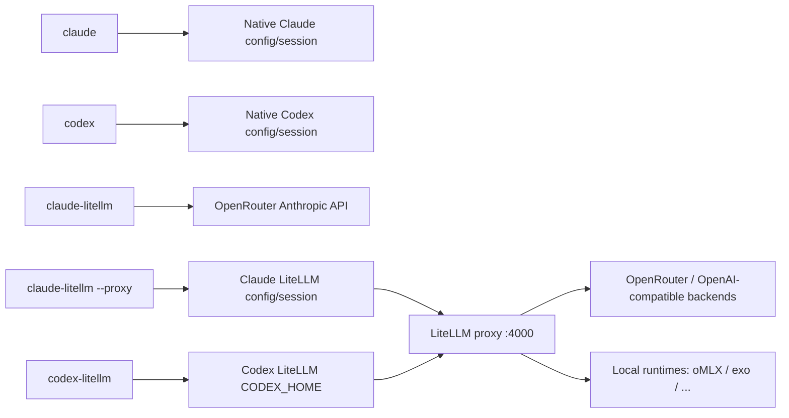

# Claude Code / Codex Gateway Architecture

Last updated: 2026-07-04

## 결론

현재 구조는 다섯 가지 실행 경로를 분리한다.

- `claude`: native Claude Code OAuth/session
- `codex`: native Codex OAuth/session
- `claude-litellm`: Claude Code through OpenRouter Anthropic-compatible API, no local proxy
- `claude-litellm --proxy`: Claude Code through local LiteLLM for local/non-Claude routes
- `codex-litellm`: Codex through local LiteLLM

provider/model registry에 대해서는 두 가지 source of truth만 둔다.

- **Claude direct routing**: `config/claude-litellm/settings.json`의 `directAliases` (Claude tier → OpenRouter Anthropic Skin model).
- **LiteLLM 모델 라우팅**: package config의 `litellm_config.yaml` `model_list` (surface model_name → underlying provider model).
- **모델별 토큰 한도(context window / max output)**: 같은 파일의 `x-limits:` YAML 앵커. underlying 모델당 앵커 1개, surface 엔트리는 `model_info: *alias`로 참조한다. 앵커 한 줄을 고치면 모든 harness 설정이 파생된다([토큰 한도 / Context Window 관리](#토큰-한도--context-window-관리) 참조).

claude-litellm의 기본 모드는 `proxy`다(LiteLLM 경유, tier는 비-Anthropic 모델 — 2026-06-12 결정 로그 참조). Claude direct 경로(`--direct`)는 OpenRouter의 Anthropic-compatible API를 직접 본다. 런처는 `ANTHROPIC_BASE_URL=https://openrouter.ai/api`, `ANTHROPIC_AUTH_TOKEN=<OpenRouter key>`, `ANTHROPIC_API_KEY=`를 subprocess에만 주입하고, `ANTHROPIC_DEFAULT_*_MODEL`을 `directAliases`에서 파생한다. 기본 direct tier는 `opus`다. 이 경로에서는 local LiteLLM proxy를 시작하지 않고 `CLAUDE_CODE_MAX_OUTPUT_TOKENS`/`CLAUDE_CODE_AUTO_COMPACT_WINDOW`도 주입하지 않는다.

Claude 두 모드 모두 `CLAUDE_CODE_ATTRIBUTION_HEADER=0`을 주입하고, isolated config dir 안의 user-scope 환경 파일(settings/plugins/skills/CLAUDE.md)은 `~/.claude`로 symlink되어 native와 공유된다. 세션 상태(`projects/`, history, 자격증명)는 변형별로 격리를 유지한다 — 근거와 경계는 [2026-06-11 세션 경계/공유 환경 결정 로그](#2026-06-11-세션-경계공유-환경-결정-로그) 참조.

Claude proxy fallback의 매 요청 출력 예약은 모델 능력치가 아니므로 `x-limits`에 넣지 않는다. Claude harness adapter 정책(`__AI_LITELLM_HOME__/config/ai-litellm/harnesses/claude.json`의 `adapterConfig.outputReservation`)에서 별도로 관리하고, proxy 경로 런처가 `CLAUDE_CODE_MAX_OUTPUT_TOKENS`와 `CLAUDE_CODE_AUTO_COMPACT_WINDOW`를 여기서 파생한다.

context window는 단일 숫자가 아니라 `native product/session`, `provider/API`, `LiteLLM route`, `harness metadata`, `runtime capability`가 따로 존재한다. 이 값들은 자동으로 상속되지 않는다. 확인은 `ai-litellm context matrix|probe`와 `ai-litellm doctor --context`로 한다([Context Budget 검증](#context-budget-검증) 참조).

명령어는 noun-verb 체계(`ai-litellm <group> <verb>`)를 정본으로 한다([명령어 체계](#명령어-체계) 참조). 이 문서는 모델 표를 반복하지 않고, 확인 명령과 운영 원칙만 기록한다. 각 설계 결정의 **이유·기각된 대안·반론 여지**는 [DESIGN_RATIONALE.md](DESIGN_RATIONALE.md)가 종합한다 — 구조를 바꾸기 전에 그쪽의 해당 절을 먼저 읽어라.

## 구조



## Source Of Truth

| 역할 | 파일 |
| --- | --- |
| Installed package root | `__AI_LITELLM_HOME__` (default `__HOME__/.local/share/ai-litellm`) |
| LiteLLM provider/model registry | `__AI_LITELLM_HOME__/config/litellm_config.yaml` |
| 모델별 토큰 한도 단일 출처 (`x-limits:` 앵커) | `__AI_LITELLM_HOME__/config/litellm_config.yaml` |
| Claude direct/proxy alias/default/display names | `__AI_LITELLM_HOME__/config/claude-litellm/settings.json` |
| Codex LiteLLM aliases | `__AI_LITELLM_HOME__/config/codex-litellm/settings.json` |
| Harness descriptor schema | `__AI_LITELLM_HOME__/config/ai-litellm/harnesses/schema.json` |
| Claude harness descriptor | `__AI_LITELLM_HOME__/config/ai-litellm/harnesses/claude.json` |
| Codex harness descriptor | `__AI_LITELLM_HOME__/config/ai-litellm/harnesses/codex.json` |
| Claude Code proxy fallback 출력 예약 정책 | `__AI_LITELLM_HOME__/config/ai-litellm/harnesses/claude.json`의 `adapterConfig.outputReservation` |
| Codex LiteLLM generated config | `__AI_LITELLM_HOME__/state/codex-litellm/codex-home/config.toml` |
| Codex LiteLLM compatibility catalog | `__AI_LITELLM_HOME__/state/codex-litellm/model-catalog.json` |
| Shared LiteLLM proxy settings | `__AI_LITELLM_HOME__/config/ai-litellm/settings.json` |
| Shared LiteLLM proxy library | `__AI_LITELLM_HOME__/config/ai-litellm/lib.zsh` |
| Context probe observation seed (repo-managed evidence) | `__AI_LITELLM_HOME__/config/ai-litellm/context-observations.json` |
| Context probe observation cache (local evidence) | `__AI_LITELLM_HOME__/state/ai-litellm/context-observations.json` |
| Reasoning probe observation cache (evidence, not source of truth) | `__AI_LITELLM_HOME__/state/ai-litellm/reasoning-observations.json` |
| Private env file (local secrets, not git) | `__AI_LITELLM_HOME__/state/ai-litellm/env` |
| Installed package tools | `__AI_LITELLM_HOME__/scripts/uninstall.zsh` |
| Shared LiteLLM proxy command shim | `__HOME__/.local/bin/ai-litellm` → `__AI_LITELLM_HOME__/bin/ai-litellm` |
| Claude command shim | `__HOME__/.local/bin/claude-litellm` → `__AI_LITELLM_HOME__/bin/claude-litellm` |
| Codex LiteLLM command shim | `__HOME__/.local/bin/codex-litellm` → `__AI_LITELLM_HOME__/bin/codex-litellm` |
| Claude client helper | `__AI_LITELLM_HOME__/config/claude-litellm/shell.zsh` |
| Codex client helper | `__AI_LITELLM_HOME__/config/codex-litellm/shell.zsh` |
| Native Codex user config | `__HOME__/.codex/config.toml` |

GitHub clone/download만으로 전역 명령이 등록되지는 않는다. `scripts/install.zsh`를 한 번 실행하면 package directory를 만들고, `__HOME__/.local/bin`에 얇은 shim을 생성한다. 이후 어느 디렉토리에서나 `claude-litellm`, `codex-litellm` 등을 호출할 수 있다. shim은 native `claude`, `codex`를 대체하지 않는다. 설치기는 checkout 밖의 package 안에도 `scripts/uninstall.zsh`를 복사하므로, repo checkout을 지운 뒤에도 `ai-litellm uninstall` 또는 `__AI_LITELLM_HOME__/scripts/uninstall.zsh`로 package/shim을 제거할 수 있다.

`__AI_LITELLM_HOME__/state/codex-litellm/codex-home/config.toml`은 generated config다. Codex provider base URL은 직접 관리하지 않고, 실행 시점에 `ai-litellm` server settings에서 파생한다.

Native Codex에는 현재 context catalog override를 두지 않는다. `__HOME__/.codex/config.toml`에 `model_catalog_json` 또는 `model_context_window`를 넣어 API/LiteLLM 쪽 context 값을 강제로 투영하지 않는다. native Codex는 installed Codex bundle/product session budget을 따른다. 확인:

```zsh
codex debug models | jq '.models[] | select(.slug=="gpt-5.5") | {slug, context_window, max_context_window, effective_context_window_percent}'
rg -n '^[[:space:]]*(model_catalog_json|model_context_window)[[:space:]]*=' ~/.codex/config.toml
```

과거에 `__HOME__/.codex/model-catalog-local.json`, `model-catalog-codex-safe.json`, `model-catalog-api-long.json`, `api-long.config.toml`로 native context를 늘리는 실험을 했지만, 이는 기본 설치 동작과 혼동을 만들 수 있어 제거했다. 다시 실험해야 한다면 운영 설정이 아니라 임시 profile로만 두고, 문서/doctor에는 `experimental`로 표시한다.

`~/.zshrc`는 `~/.local/bin`을 PATH에 추가할 뿐이다. helper는 interactive shell에 자동 source하지 않고, package 안의 각 command wrapper가 실행 시점에만 불러온다. 설치기는 native harness command 존재 여부를 강제하지 않는다. 없는 harness는 그 wrapper를 실제 실행할 때만 실패해야 한다.

## 명령어 체계

`ai-litellm`은 noun-verb 체계를 정본으로 한다. 그룹(noun)이 시스템 개념이고, verb가 그 개념에 대한 동작이다. P4(2026-07-05)에서 표면을 아래 트리로 슬리밍했다 — 무엇이 빠졌고 왜인지는 [2026-07-05 명령 표면 슬리밍 결정 로그](#2026-07-05-명령-표면-슬리밍-결정-로그) 참조.

```zsh
ai-litellm status  # proxy/harness/runtime/key/model 한 방 요약 (+--json; capability 요약도 흡수)
ai-litellm proxy   status|start|stop|restart|logs [lines]
ai-litellm harness list|info <name>|launch <name> [model] [args...]|alias get <name>|alias set <harness> <tier> <model>|reasoning [name|allowed <name>|set <name> <effort>|unset <name>]
ai-litellm runtime list|status [name]
ai-litellm model   list|info [model]|limits [model]|probe [model...]|refresh-capabilities [opts]|add <provider-id> [opts]|remove <surface> [--dry-run]|reasoning probe <model> [effort]|reasoning set <model> <effort>|reasoning unset <model>|reasoning allowed <model>
ai-litellm context matrix [filter]|probe <surface|all>|observations [filter]
ai-litellm reasoning matrix [model]|probe <model> [effort]
ai-litellm doctor [--proxy|--context|--reasoning|--policy|--runtime <name>]
ai-litellm key     status|set <openrouter|ENV_VAR|provider-name> [value]
ai-litellm sync [--dry-run] [--no-restart]  # 단일 출처에서 파생 설정 재생성 + 기본적으로 proxy 재기동
ai-litellm uninstall  # package directory와 global shim 제거
```

`proxy`/`context`/`reasoning`/`runtime` 그룹에는 더 이상 각자의 `doctor` verb가 없다 — 모든 진단은 위 `ai-litellm doctor --<scope>`로만 들어간다(per-group `doctor` CLI 진입점은 P4에서 제거됐다; 내부 체크 함수 자체는 그대로이고 `ai_litellm_cmd_doctor`가 직접 호출한다). `route` 그룹과 `audit` 그룹, 최상위 `capabilities` 명령은 각각 `model`/`doctor`/`status`로 흡수됐다 — `ai-litellm model probe [model...]`가 route probing의 정본이고(인자 없으면 모든 모델; 한때 deprecated였던 `model probe`가 `route` 그룹 소멸과 함께 다시 정본이 됐다 — H6 역전), `ai-litellm doctor --policy`가 구 `audit model-policy`를, `ai-litellm status`가 구 `capabilities`를 흡수했다. `ai-litellm model info [model]`은 GET `/model/info`의 **전체 `model_info` 블록**을 출력한다(한때 `route info`와 byte-identical이었던 이력 — M21, `ai_litellm_model_info`).

과거의 flat 명령(`ai-litellm start`, `route-info`, `harnesses`, `launch`, `claude-litellm --start` 등 13종)과 harness launcher의 lifecycle flag(`--start|--stop|--restart|--logs|--doctor`, codex `--route-info`)는 deprecated 경고-후-위임 단계를 졸업하고 P4에서 완전히 제거됐다. proxy lifecycle은 harness wrapper가 아니라 `ai-litellm proxy *`가 소유한다. `claude-litellm`/`codex-litellm`에는 harness별 정보 조회용 `--list`/`--status`만 남고, Codex는 카탈로그 재생성용 `--refresh-catalog`도 유지한다.

### `--json` read surface (additive, formatter-only)

read-only 명령군에 `--json` 출력이 추가됐다. `--json`은 **순수 출력 포매터**일 뿐이며 state를 다시 파생하지 않는다 — `--json` 없는 기본 text 출력은 byte-identical로 유지된다. 키는 camelCase, 항상 valid JSON + exit 0이고, 읽을 수 없는 source는 `{}`/`[]`로 떨어진다(빈-출력 정직성). read-only 명령만 대상이고 mutating 명령에는 붙이지 않는다. 이 표면은 스크립팅·자동화용 계약이다 — `ai-litellm status --json`이 이 중 다섯 개(`proxy status`/`harness list`/`runtime status`/`key status`/`model list`)를 그대로 합성해(`{proxy,harnesses,runtimes,keys,models}`) 소비자 노릇을 한다.

| 명령 | emitter |
| --- | --- |
| `proxy status --json` | `ai_litellm_status_json` |
| `model list --json` | `ai_litellm_list_json` |
| `model limits [model] --json` | `ai_litellm_model_limits_json` |
| `runtime status [name] --json` | `ai_litellm_runtime_status_json` |
| `harness list --json` / `harness info <name> --json` | `ai_litellm_harnesses_json` / `ai_litellm_harness_info_json` |
| `reasoning matrix [model] --json` | `ai_litellm_reasoning_matrix_json` (`AI_LITELLM_MATRIX_JSON=1`로 기존 Ruby 재사용) |
| `context matrix [filter] --json` | `ai_litellm_context_matrix_json` (동일한 `AI_LITELLM_MATRIX_JSON` 플래그) |
| `key status --json` | `ai_litellm_key_status_json` |

구현은 lib.zsh 안에 sibling `*_json` emitter + `ai_litellm_emit_json` 헬퍼로 두고, matrix류는 출력 분기 env 플래그(`AI_LITELLM_MATRIX_JSON`)로 기존 Ruby 경로를 재사용한다(중복 없음). backend 로직은 건드리지 않았다.

## 확인 명령

실제 provider route는 모델에게 묻지 말고 LiteLLM metadata로 확인한다.

```zsh
ai-litellm model list
ai-litellm model info GLM-5.2-openrouter
ai-litellm model limits          # 모델별 context/output 한도 표 (단일 출처)
ai-litellm model refresh-capabilities --check  # OpenRouter 정본과 x-limits drift 확인
ai-litellm reasoning matrix      # provider/backend reasoning capability 표
ai-litellm reasoning probe GLM-5.2-openrouter xhigh
ai-litellm doctor --reasoning
ai-litellm model reasoning set Kimi-K2.7-Code-openrouter none
ai-litellm model reasoning unset Kimi-K2.7-Code-openrouter
ai-litellm harness reasoning     # harness adapter reasoning resolver preview
ai-litellm harness reasoning set codex high
ai-litellm harness reasoning unset codex
ai-litellm context matrix          # native + LiteLLM + runtime context budget 표
ai-litellm context probe codex-cli-oauth
ai-litellm context probe codex-litellm
ai-litellm context probe omlx-runtime
ai-litellm context observations
ai-litellm doctor --context
ai-litellm doctor --policy       # 구 'audit model-policy'
ai-litellm doctor                # 전체 배터리(proxy+context+reasoning+policy)
ai-litellm model probe            # 모든 모델 (인자로 좁힘; route 흡수 후 정본 — H6 역전)
ai-litellm model probe Qwen3.6-27B-omlx
ai-litellm harness list
ai-litellm harness info claude
ai-litellm harness info codex

claude-litellm --status   # harness별 정보
claude-litellm --list
codex-litellm --status
codex-litellm --list
```

## Proxy 관리

`claude-litellm`과 `codex-litellm`은 같은 LiteLLM proxy를 공유한다. proxy lifecycle은 `ai-litellm`이 소유한다.

```zsh
ai-litellm proxy status
ai-litellm proxy start
ai-litellm proxy stop
ai-litellm proxy restart
ai-litellm proxy logs
ai-litellm doctor --proxy
```

`claude-litellm` 기본 실행은 shared LiteLLM proxy 경로다(2026-06-12 결정 로그). `--direct`를 명시할 때만 OpenRouter Anthropic-compatible 직결 경로를 쓰며, local runtime 모델과 registry route는 proxy 경로에서만 서빙된다.

`ai-litellm doctor --proxy`는 running proxy가 현재 registry hash를 로드했는지 확인한다. registry를 바꾼 뒤 재기동을 잊으면 `running proxy loaded current config` 또는 `running proxy routes match config`가 실패한다. 토큰 한도를 바꾼 경우 `ai-litellm sync` 한 번이면 파생 설정 재생성과 재기동이 모두 처리된다. 재기동 없이 생성물만 갱신하려면 `ai-litellm sync --no-restart`, 변경 없이 동작 계획만 확인하려면 `ai-litellm sync --dry-run`을 쓴다. `sync`는 Codex catalog/config, Claude isolated settings 같은 파생물을 각 harness CLI 설치 여부와 분리해서 다룬다. 없는 native CLI는 catalog refresh나 launch에서만 skip/fail하고, metadata/doctor/config 생성은 깨지지 않아야 한다.

proxy start에는 lock을 둬서 꺼진 상태에서 동시에 시작해도 중복 기동을 피한다. 단, `stop`/`restart`/`sync`는 공유 proxy를 내리므로 실행 중인 Claude proxy fallback/Codex LiteLLM 세션 모두에 영향을 준다.

Codex shortcut은 shell 편의 기능일 뿐이다. harness, skill, 문서에는 shortcut보다 Codex surface model name을 쓴다.

`review`는 Codex의 실제 subcommand와 충돌하므로 shortcut으로 쓰지 않는다. 필요하면 `codex-auto-review`처럼 실제 model name을 직접 지정한다.

```zsh
codex-litellm codex-auto-review
```

## Harness 관리

Claude/Codex wrapper는 descriptor-backed adapter로 실행된다. 기존 `claude-litellm`/`codex-litellm` 명령은 유지하되, path, command, isolation, Codex subcommands, generated Codex config는 harness descriptor에서 읽는다. Claude descriptor의 provider는 direct OpenRouter endpoint를 표현하고, proxy fallback은 launcher가 `ai_litellm_base_url`과 LiteLLM master key를 명시적으로 사용한다.

```zsh
ai-litellm harness list
ai-litellm harness info claude
ai-litellm harness info codex

ai-litellm harness launch claude sonnet -p "Reply with exactly OK" --no-session-persistence --tools ""
ai-litellm harness launch claude --proxy haiku -p "Reply with exactly OK" --no-session-persistence --tools ""
ai-litellm harness launch codex exec --skip-git-repo-check --sandbox read-only "Reply with exactly OK"
```

## 토큰 한도 / Context Window 관리

LiteLLM-backed 모델별 context window(`max_input_tokens`)와 max output(`max_output_tokens`)의 단일 출처는 `litellm_config.yaml`의 `x-limits:` 앵커다. **underlying provider 모델당 앵커 1개**를 두고, 모든 surface 엔트리가 `model_info: *alias`로 참조한다. 6개의 surface model_name은 5개의 underlying 백엔드로 수렴하며, 이들이 4개의 앵커를 공유한다(예: Qwen 27B와 35B는 의도적으로 같은 `qwen36_27b_local` 앵커를 공유; `codex-auto-review`는 `Kimi-K2.7-Code-openrouter`와 같은 앵커를 공유), surface가 늘어도 한도는 underlying 앵커에만 붙는다.

입력 편의를 위해 wrapper는 `model_name`뿐 아니라 `litellm_params.model` 값도 resolver 입력으로 받는다. 예를 들어 `openrouter/z-ai/glm-5.2` 또는 `z-ai/glm-5.2`는 registry의 기존 route로 해석된다. 이는 중복 route를 git에 추가하는 것이 아니라 실행 직전 canonical `model_name`으로 매핑하는 UX 계층이다. Codex는 catalog에 없는 raw provider-facing 이름을 직접 넘기면 실패할 수 있으므로, 같은 backend를 가리키는 registry entry가 여럿이면(예: `codex-auto-review`와 `Kimi-K2.7-Code-openrouter`가 같은 Kimi 백엔드를 공유) descriptor의 `models.catalogEntries`에 실제로 노출되는(카탈로그에 slug로 등재된) 이름을 우선 선택한다 — gpt-* facade가 있던 시절의 "codex-safe facade를 우선 선택"이 남긴 규칙이 실명 시대에는 "카탈로그에 실린 이름을 우선 선택"으로 축소된 것이다.

각 숫자는 `x_input_confidence` / `x_output_confidence` / `x_reasoning_confidence`로 출처를 표시한다. OpenRouter가 공개한 값은 `provider`, 로컬 probe가 확정한 값은 `observed`, provider가 공개하지 않아 의도적으로 낮춰 둔 정책 cap은 `owned-policy`다. `local-config`가 남아 있으면 아직 정본/관측/정책 중 어디에도 속하지 않은 값이므로 audit 대상이다.

중요한 구분:

- **출력 능력치 또는 policy ceiling**: provider가 공개한 최대 출력 또는, 공개값이 없을 때 명시적으로 소유한 보수적 ceiling. capability metadata가 필요한 generated artifact는 여기서 파생하되 confidence를 함께 본다. 예: codex 생성 카탈로그의 `context_window`는 capability가 아니라 safe input budget이며, capability-파생 값은 confidence 라벨과 함께 본다.
- **출력 예약(reservation)**: harness가 매 요청에서 provider에 예약시키는 출력 토큰. 공유 윈도우 provider가 `입력 + 예약 출력 <= context`로 회계하면 이 값은 작아야 한다.

Claude direct 경로는 OpenRouter Anthropic Skin이 Claude Code native protocol을 직접 처리하도록 두므로 `CLAUDE_CODE_MAX_OUTPUT_TOKENS`를 주입하지 않는다. Claude proxy fallback은 `CLAUDE_CODE_MAX_OUTPUT_TOKENS`를 매 요청 `max_tokens` 예약으로 사용하므로, 이 env에는 `max_output_tokens` 능력치를 넣지 않는다. Codex LiteLLM은 Responses 요청에 신뢰할 만한 output cap을 주입하지 못하므로 generated catalog의 `context_window`를 safe input budget으로 낮춘다. 현재 reservation 기본 정책은 `32000`, tokenizer headroom `8192`, minimum input `32768`이다. proxy fallback 런처/생성기 계산식:

```text
output_reservation = adapterConfig.outputReservation(default/perTier/perModel)
effective_input = max_input_tokens - output_reservation - tokenizer_headroom
CLAUDE_CODE_MAX_OUTPUT_TOKENS = output_reservation
CLAUDE_CODE_AUTO_COMPACT_WINDOW = effective_input
CODEX model-catalog.context_window = effective_input
```

이 분리는 harness별 runtime 예약에만 적용한다. Codex catalog는 capability source가 아니라 `codex-litellm` 전용 compatibility shim이므로 raw provider window 대신 safe input window를 기록한다. raw LiteLLM client와 future harness의 초과 출력 예약은 proxy-level C4 hook(`ai_litellm_callbacks.output_clamp.proxy_handler_instance`)이 deployment 직전에 `max_tokens`/`max_completion_tokens`를 model-aware safe cap으로 낮춘다. 같은 hook은 `x-gateway-cost-guardrail`의 estimated-token 상한도 적용해 거대 prompt를 provider dispatch 전에 거부한다. doctor는 이 hook과 `x-gateway-output-clamp`/`x-gateway-cost-guardrail` 정책이 빠지면 실패한다.

native Codex/Claude의 제품 세션 budget은 이 앵커를 상속하지 않는다. OpenAI API가 선언하는 모델별 context, Codex App/CLI OAuth context, Codex LiteLLM 생성 카탈로그의 context는 서로 다른 claim으로 관리한다.

```yaml
x-limits:
  kimi_k27_code: &kimi_k27_code
    max_input_tokens: 262144
    max_output_tokens: 16384
    supports_reasoning: true
    x_input_confidence: provider
    x_input_source: openrouter.top_provider.context_length
    x_output_confidence: provider
    x_output_source: openrouter.top_provider.max_completion_tokens
model_list:
  - model_name: Kimi-K2.7-Code-openrouter
    litellm_params: { model: openrouter/moonshotai/kimi-k2.7-code, api_key: os.environ/OPENROUTER_API_KEY }
    model_info: *kimi_k27_code
  - model_name: codex-auto-review   # 같은 underlying → 같은 앵커 (Codex `review`가 하드코딩하는 hidden slug)
    litellm_params: { model: openrouter/moonshotai/kimi-k2.7-code, api_key: os.environ/OPENROUTER_API_KEY }
    model_info: *kimi_k27_code
```

`x-limits:`는 LiteLLM이 모르는 최상위 키라 `safe_load`가 무시한다. `model_info`에는 public token/capability metadata만 두며 secret은 들어가지 않는다.

이 단일 출처에서 각 경로가 파생된다.

| 대상 | 파생 방식 | 자동? |
| --- | --- | --- |
| LiteLLM proxy (`/model/info` + pre-call enforcement) | `router_settings.enable_pre_call_checks: true` → 입력이 한도 초과 시 truncate가 아니라 `ContextWindowExceededError`로 거부 | proxy 재기동 시 |
| Codex `model-catalog.json`의 `context_window` | `codex-litellm --refresh-catalog` 생성기가 `adapterConfig.outputReservation`을 빼고 safe input window를 기록 | `ai-litellm sync` |
| Claude `CLAUDE_CODE_AUTO_COMPACT_WINDOW` / `_MAX_OUTPUT_TOKENS` | launch env 주입(활성 모델 기준; `_MAX_OUTPUT_TOKENS`는 capability가 아니라 reservation) | 다음 launch |

Claude는 gateway에서 context window를 자동 discovery하지 못하므로(검증된 한계) launch 시 env로 주입한다. Claude의 `AUTO_COMPACT_WINDOW`은 tier가 믿는 window(200K, `[1m]`이면 1M) 아래로만 낮출 수 있다. 공유 윈도우 provider에서는 Claude의 compact threshold를 `effective_input`으로 낮춰 provider 거부 전에 압축이 걸리게 한다. 어느 경우든 LiteLLM pre-call enforcement가 진짜 한도를 강제하는 최종 backstop이다.

```zsh
ai-litellm model limits                        # 모델별 context/output 표
ai-litellm model limits Kimi-K2.7-Code-openrouter  # 특정 모델
ai-litellm model refresh-capabilities
ai-litellm model refresh-capabilities --apply  # provider가 공개한 drift만 반영
ai-litellm doctor --proxy          # "harness configs match single-source limits"로 staleness 점검
```

한도 변경 절차: OpenRouter-backed 모델은 먼저 `ai-litellm model refresh-capabilities`로 provider 정본을 확인하고, `--apply`가 반영할 수 없는 값만 `owned-policy`로 명시한다. 그 뒤 `ai-litellm sync` 한 번으로 파생 설정을 재생성한다. 새 모델 추가 시에도 한도 숫자는 앵커에 한 번만 적고 surface 엔트리는 `model_info: *alias`로 참조한다.

## Context Budget 검증

context budget은 다음 층위로 분리해서 본다.

| 층위 | 예 | 관리 원칙 |
| --- | --- | --- |
| native product/session | `codex`, `claude` | provider/API 또는 LiteLLM 생성 카탈로그 값을 자동 상속하지 않는다. 공식 문서와 local startup metadata로만 판단한다. |
| provider/API declared | OpenAI API `gpt-5.5`, OpenRouter `/models` | provider가 선언한 모델 한도. routing endpoint별 실제 cap과 다를 수 있으므로 `source_confidence`를 둔다. |
| LiteLLM route enforced | `model_info.max_input_tokens`, `enable_pre_call_checks` | oversized prompt를 provider로 보내기 전에 거부하는 gateway backstop. |
| harness metadata/compaction | Codex catalog, Claude auto compact | 실제 provider enforcement인지, 표시/compaction/accounting인지 구분한다. |
| local runtime capability | oMLX `/v1/models`, model `config.json` | runtime capability와 LiteLLM policy cap이 다를 수 있다. |

read-only 확인 명령:

```zsh
ai-litellm context matrix
ai-litellm context matrix codex-litellm
ai-litellm context probe codex-cli-oauth
ai-litellm context probe codex-cli-api
ai-litellm context probe codex-litellm
ai-litellm context probe omlx-runtime
ai-litellm context observations
ai-litellm doctor --context
```

## Proxy Output Clamp 검증

LiteLLM gateway의 입력 한도 방어와 출력 예약 clamp는 별개다. LiteLLM 문서상 `router_settings.enable_pre_call_checks`와 `model_info.max_input_tokens`는 provider 호출 전에 입력 token 초과를 거부하는 레버다. 반면 harness가 큰 `max_tokens` 또는 `max_completion_tokens`를 명시했을 때 provider 직전 요청을 안전하게 낮추는지는 별도 검증이 필요하다.

검증 harness:

```zsh
./scripts/verify_litellm_token_clamp.py
```

이 스크립트는 실제 provider를 호출하지 않는다. 로컬 OpenAI-compatible mock provider와 임시 LiteLLM proxy를 띄운 뒤, mock provider가 받은 JSON body를 증거로 삼는다.

LiteLLM 1.81.14→1.91.0(2026-07-05 재확인) 기준 관찰:

- `litellm_params.max_tokens`는 client가 `max_tokens`를 보내지 않으면 기본값으로 upstream에 들어간다.
- plain config는 client가 더 큰 `max_tokens`를 보내면 override하지 못한다.
- `litellm_settings.modify_params: true`는 client `max_tokens`를 route의 `litellm_params.max_tokens`까지 낮춘다.
- `modify_params: true`만으로는 client `max_completion_tokens`를 낮추지 못한다.
- custom callback의 `async_pre_call_deployment_hook`은 deployment 선택 뒤 provider 호출 직전에 `max_tokens`와 `max_completion_tokens`를 모두 낮추는 것이 확인됐다.

따라서 production 정책은 harness-side reservation을 1차 방어로 유지하고, proxy-level C4 hard clamp를 defense-in-depth로 켠다. hook 파일은 `config/ai_litellm_callbacks/output_clamp.py`이고 `litellm_settings.callbacks`에서 `ai_litellm_callbacks.output_clamp.proxy_handler_instance`를 참조한다. hook은 `async_pre_call_deployment_hook`에서 deployment 선택 뒤 `model_info.max_output_tokens`(capability)와 `x-gateway-output-clamp`의 `default/tokenizer_headroom/minimum_input` 정책을 결합해 safe cap을 계산한다. client가 그보다 큰 `max_tokens` 또는 `max_completion_tokens`를 보낸 경우에만 값을 낮추며, 요청에 출력 토큰 key가 없으면 새 예약값을 주입하지 않는다. 그 다음 `x-gateway-cost-guardrail`의 estimated input/total token 상한을 검사해 초과 요청을 provider에 보내기 전에 거부한다. 이는 billing DB 기반 예산 추적이 아니라 per-request 운영 가드레일이다.

현재 기본값:

```yaml
x-gateway-output-clamp:
  enabled: true
  default: 32000
  tokenizer_headroom: 8192
  minimum_input: 32768

x-gateway-cost-guardrail:
  enabled: true
  max_estimated_input_tokens: 200000
  max_estimated_total_tokens: 240000
  chars_per_token: 4
```

`ai-litellm context matrix`의 핵심 컬럼:

| 컬럼 | 의미 |
| --- | --- |
| `surface` | 실행 표면. 예: `codex-cli-oauth`, `codex-litellm`, `omlx-runtime`. |
| `selection` | 사용자가 고르는 모델/tier/default 이름. |
| `auth` | OAuth, API key, LiteLLM master key, local 등 auth lane. |
| `provider_model` | 실제 provider/backend model. native surface는 native provider model, LiteLLM surface는 `litellm_params.model`. |
| `budget_kind` | `provider-declared`, `harness-session`, `harness-catalog+router`, `display/compact+router`, `runtime-capability` 등. |
| `declared(ctx/out)` | 공식/provider/runtime이 선언한 값. |
| `configured(ctx/out)` | 현재 local config에 들어간 값. |
| `observed` | bounded probe나 session event에서 관측한 값. `>=N`은 관측된 하한(lower bound)이며 max window 확정값이 아니다. 과거 session event는 historical evidence로만 본다. |
| `effective_input` | 현재 architecture가 입력 예산으로 다루는 값. Reservation policy가 있는 harness는 출력 예약과 tokenizer headroom을 차감한 값이다. |
| `enforcement` | 실제 차단 계층. 예: Codex catalog, LiteLLM pre-call, runtime+LiteLLM. |
| `confidence` | official, local-config, unprobed, inactive, model-file 등 신뢰도 태그. |

LiteLLM-backed harness 행은 harness 이름별 `case`가 아니라 descriptor에서 파생한다. `adapterConfig.context.surface`, `budgetKind`, `authLane`, `confidence`가 row metadata이고, selection은 descriptor의 `models.default`, `models.small`, `models.mode=tier-aliases`, settings alias, `localCatalogEntries`, 또는 명시 `adapterConfig.context.selections`에서 온다. 새 harness가 descriptor에 모델 선택을 갖고 있으면 `ai-litellm context matrix`와 `ai-litellm context probe all`에 코드 수정 없이 나타난다. `ai-litellm doctor --context`는 descriptor surface 중복을 실패로 잡는다.

`ai-litellm doctor --context`는 context 전용 guardrail이다. 현재 검사/경고:

- native Codex에 active `model_catalog_json`/`model_context_window` override가 없는지 확인한다.
- native Codex active `gpt-5.5` metadata가 bundled catalog와 같은지 확인한다.
- LiteLLM `enable_pre_call_checks`가 켜져 있는지 확인한다.
- gateway output clamp 정책이 유효하고 C4 callback이 설정되어 있는지 확인한다.
- gateway estimated-token cost guardrail 정책이 유효하고 같은 callback으로 설정되어 있는지 확인한다.
- context observation seed/cache가 읽을 수 있는 JSON인지 확인한다.
- harness descriptor의 context surface가 중복되지 않는지 확인한다.
- Codex generated config가 `x-limits` 단일 출처와 drift하지 않는지 확인한다.
- output reservation 정책이 있는 모든 harness가 최소 입력 여유를 남기는지 확인한다.
- OpenRouter-backed anchor가 provider 정본과 drift하거나 source metadata가 빠진 경우를 경고한다.
- oMLX runtime/model file context가 LiteLLM policy cap보다 큰 경우를 `owned-policy` 또는 drift로 구분한다.
- output cap의 `x_output_confidence`가 `owned-policy`인 모든 앵커(현재 `mimo_v25`, 로컬 `qwen` 앵커들)를 provider/observed 확인이 없는 보수적 로컬 상한으로 경고한다 — 특정 모델에 하드코딩되지 않으며, GLM-5.2는 provider-confidence로 전환되어 더 이상 해당하지 않는다.

`ai-litellm context observations [filter]`는 repo-managed seed와 local state cache를 합쳐 보여준다. seed에는 현재 두 하한 증거가 들어 있으며, 둘 다 은퇴한 라우트 시절의 역사 증거로 보존된 것이다(라우트가 죽어도 관측은 삭제하지 않는다 — F2.5 규칙): 당시 Claude `opus`였던 DeepSeek의 `>=211580` input token 통과 기록과, 은퇴한 GLM-5.1 시절의 `>=204800`/`202752` boundary 관측 쌍이다. 현행 GLM-5.2 enforcement는 provider-authoritative 앵커(1048576/128000)를 그대로 쓴다 — 관측은 증거일 뿐 enforcement가 아니라는 원칙은 동일하다. 새 관측은 비싼 probe runner를 자동 실행하지 않고 다음처럼 기록한다.

```zsh
ai-litellm context probe record claude-litellm opus DeepSeek-V4-Pro 211580 \
  --status lower_bound --cost-usd 1.05905 --notes "tail marker returned"
```

중요한 판정 규칙:

- native Codex surface는 LiteLLM 생성 카탈로그 한도를 상속하지 않는다.
- API model spec은 OAuth/App spec이 아니다. 공식 문서나 local startup metadata가 없으면 `unknown` 또는 `inactive`로 둔다.
- OpenRouter `/models.context_length`는 model-level metadata이며, endpoint routing별 실제 cap 검증과 구분한다.
- runtime capability가 더 크더라도 LiteLLM `model_info.max_input_tokens`가 낮으면 현재 effective input budget은 policy cap 쪽이다.

## Reasoning / Effort 관리

reasoning, effort, thinking은 두 레이어로 분리한다.

- **Provider/backend default**: OpenRouter/LiteLLM/backend route가 wire parameter를 받을 수 있는지와, harness가 아무 값을 내지 않을 때 적용할 route 기본값. 예: OpenRouter `reasoning`, `include_reasoning`.
- **Harness intent**: Claude Code, Codex가 선택 모델과 effort/thinking 개념을 어떻게 해석하고 전달하는지. 예: Claude tier(`opus`/`sonnet`/`haiku`) + `--effort`, Codex `model_reasoning_effort`.

이 둘은 독립적으로 관리한다. 실제 요청에서 둘 다 존재하면 `explicit harness intent > harness auto/default > provider/route default > no reasoning override` 순서로 해석한다. provider default는 LiteLLM route에 붙는 기본값이고, harness intent는 해당 harness가 자기 CLI/config/env 방식으로 표현하는 실행 의도다.

```zsh
ai-litellm reasoning matrix         # model_name -> provider/backend reasoning capability
ai-litellm reasoning matrix GLM-5.2-openrouter
ai-litellm reasoning probe GLM-5.2-openrouter xhigh
ai-litellm doctor --reasoning
ai-litellm model reasoning set Kimi-K2.7-Code-openrouter none
ai-litellm model reasoning unset Kimi-K2.7-Code-openrouter
ai-litellm harness reasoning        # harness selection -> resolved model -> effective preview
ai-litellm harness reasoning claude
ai-litellm harness reasoning set claude xhigh
ai-litellm harness reasoning set codex high
```

`ai-litellm reasoning matrix`는 provider/backend 관점의 유일한 조회 표다. `ai-litellm model reasoning` 그룹은 `probe|set|unset|allowed` mutation/probe surface만 갖는다 — 한때 있었던 bare `model reasoning [model]` table-alias 위임(인자 없이 부르면 경고 후 reasoning matrix로 위임하던 동작)은 P4에서 제거됐고, 지금은 인자 없이 부르면 usage 에러다. 이 표는 capability를 한 칸으로 뭉치지 않는다.

| 컬럼 | 의미 |
| --- | --- |
| `declared` | `litellm_config.yaml`의 `model_info.supports_reasoning` 선언값. 사람이 관리하는 local claim이다. |
| `litellm_cap` | 현재 설치된 LiteLLM runtime이 `supports_reasoning()`/`get_supported_openai_params()`로 보기에 reasoning 계열 parameter를 지원하는지. |
| `default` | route에 설정된 provider default. `ai-litellm model reasoning set`이 쓰는 값은 `reasoning_effort`다. |
| `local_wire` | 현재 LiteLLM adapter가 OpenAI-style parameter로 받아준다고 선언한 wire key. 비어 있으면 local LiteLLM은 해당 parameter를 지원한다고 보지 않는다. |
| `drop_risk` | `declared=yes`인데 `litellm_cap=no`인 경우, `drop_params:true` 때문에 요청 parameter가 조용히 떨어질 수 있는지. |
| `observed` | bounded probe 결과. `yes(N)`은 `reasoning_tokens` 또는 reasoning field가 관측됐다는 뜻이고, `no(0)`은 해당 probe에서는 관측되지 않았다는 뜻이다. 같은 backend를 공유하는 surface는 backend-level observation을 같이 보여준다. |

즉 `declared=yes`는 실제 wire 도달을 뜻하지 않는다. 현재 OpenRouter route는 provider 문서상 unified `reasoning`을 지원하더라도, local LiteLLM adapter가 `reasoning_effort`를 지원한다고 보지 않으면 `drop_risk=high(drop)`으로 표시한다.

`ai-litellm reasoning probe <model> [effort]`는 proxy가 이미 떠 있을 때만 작은 chat-completions 요청을 보내고, 응답의 `usage.completion_tokens_details.reasoning_tokens`, `message.reasoning`, `reasoning_content`, `reasoning_details`를 관측한다. proxy를 자동 시작하지 않으며, 결과는 secret 없는 `__AI_LITELLM_HOME__/state/ai-litellm/reasoning-observations.json`에 최신 model별 observation으로 저장되어 `observed` 컬럼에 반영된다. 이 파일은 evidence cache이지 source of truth가 아니다. `no(0)`은 “이 probe에서는 reasoning을 보지 못했다”는 뜻이지, provider가 reasoning을 절대 지원하지 않는다는 증명은 아니다.

`set`/`unset`은 **underlying 모델 단위로** 동작한다. 토큰 한도 anchor와 같은 single-source 불변식을 지키기 위해, 한 surface model_name에 `set`하면 같은 backend를 가리키는 모든 surface에 동일하게 적용된다(예: `Kimi-K2.7-Code-openrouter` 설정 시 같은 Kimi 백엔드/앵커를 공유하는 `codex-auto-review`도 함께 적용됨). wire field는 LiteLLM의 계약된 키인 `reasoning_effort`를 쓴다(raw top-level `reasoning:` 키는 비계약 passthrough라 쓰지 않는다 — LiteLLM이 OpenRouter는 `reasoning:{effort}`, OpenAI는 `reasoning_effort`로 매핑한다). 허용값: OpenRouter `none|minimal|low|medium|high|xhigh`, OpenAI `minimal|low|medium|high`.

주의: `openrouter/deepseek/*` route는 LiteLLM upstream 버그(#27439)로 effort 단계가 on/off로 평탄화될 수 있다. 단계 구분이 중요한 모델은 `extra_body.reasoning.effort` 사용을 고려한다.

`ai-litellm harness reasoning`은 harness adapter 관점의 resolver preview다. 핵심 컬럼:

| 컬럼 | 의미 |
| --- | --- |
| `adapter` | descriptor의 harness adapter. 새 harness는 이 adapter 의미를 공통 schema로 번역한다. |
| `selection` | harness 사용자가 고르는 이름. Claude는 `opus` 같은 tier, Codex는 `GLM-5.2-openrouter` 같은 surface model. |
| `resolved_model` | LiteLLM `model_name`으로 해석된 값. |
| `prov_reas` | 해당 backend가 provider reasoning control을 지원하는지. |
| `control` | harness가 reasoning intent를 갖는지(`intent`) 또는 provider default에 맡기는지(`none`). |
| `effort` | harness가 현재 표현하는 effort 값. `auto`는 harness 내부 기본값/세션 상태에 맡긴다는 뜻이다. |
| `source` | adapter가 effort/thinking 의미를 읽는 위치. |
| `effective` | 현재 설정의 해석 결과. 예: `harness-intent`, `harness-auto`, `provider-default`, `intent-unsupported`. |
| `confidence` | configured/inferred/unknown. 실제 token 변화 검증 전에는 `verified`로 올리지 않는다. |

`ai-litellm harness reasoning set/unset`은 descriptor를 수정한다. Claude는 명시 effort를 `--effort`로 주입하고 사용자가 직접 넘긴 `--effort`가 있으면 건드리지 않는다. Claude `auto`는 CLI flag를 주입하지 않으므로 표에서는 `harness-auto`로 표시된다. Codex는 descriptor의 `modelReasoningEffort`를 바꾸고 `ai-litellm sync` 때 `config.toml`의 `model_reasoning_effort`로 내려간다.

## Local Runtime 관리

local runtime은 `ai-litellm`이 자동으로 켜지 않는다. 사용자가 직접 runtime을 켜고 끄며, wrapper는 선택한 모델이 요구하는 runtime이 준비되어 있는지만 확인한다.

```zsh
omlx start
omlx stop

ai-litellm runtime list
ai-litellm runtime status
ai-litellm runtime status omlx
ai-litellm doctor --runtime omlx
ai-litellm status
```

runtime은 settings.json의 `runtimes.<name>` 블록으로 기술한다. `kind`가 readiness adapter를 결정하며(현재 `openai-compatible` — oMLX/exo/vLLM/Ollama(`/v1`) 공통, 미지원 kind는 loud-fail), `startCommandBinary`(없으면 `startCommand` 첫 단어)로 바이너리 존재를 점검한다. `ai-litellm doctor --proxy`와 `ai-litellm doctor --runtime <name>`은 runtime 블록 유효성, registry 정합성(required `expectedModels`가 있으면 registry에 존재하는지, suffix-매칭(`*-<runtime>`) 모델의 `api_base` == runtime `apiBase` — 네이밍은 lint 표면일 뿐 멤버십은 api_base 동등성으로 결정), endpoint/port 충돌(다른 runtime·proxy와 겹치지 않는지)을 검사한다. Git은 route/config/runtime metadata만 추적한다. oMLX 바이너리, runtime process, `__HOME__/.omlx/models` 아래의 실제 model weights는 각 컴퓨터의 machine-local 준비물이다.

OpenRouter 모델은 curated recommendation으로 고정 alias를 둔다. 반대로 oMLX 모델은 컴퓨터마다 적합한 모델이 다르므로 `expectedModels`는 비어 있을 수 있고, `recommendedModels`는 샘플 route만 나타낸다. `discoverModels: true`인 runtime은 `ai-litellm sync` 때 `/v1/models`를 읽어 현재 컴퓨터가 실제 serving 중인 모델을 generated local route로 추가한다.

runtime별 concrete model name은 `<모델>-<런타임 소문자>` suffix 컨벤션을 따른다(런타임 이름에서 자동 생성).

```zsh
Qwen3.6-27B-omlx
Qwen3.5-9B-MLX-8bit-omlx
```

`exo` 등 다른 runtime을 추가하면 같은 방식으로 `-exo` suffix가 자동으로 붙는다. 같은 concrete local `model_name`을 여러 runtime에 중복 등록하지 않는다(doctor가 api_key: none 마커 기준으로 검사).

oMLX 모델 테스트:

```zsh
curl http://127.0.0.1:8000/v1/models
ai-litellm sync
ai-litellm model list | grep -- -omlx
ai-litellm model info Qwen3.5-9B-MLX-8bit-omlx
claude-litellm --proxy Qwen3.5-9B-MLX-8bit-omlx -p "Reply with exactly LOCAL_OK" --no-session-persistence --tools ""
codex-litellm Qwen3.5-9B-MLX-8bit-omlx exec --skip-git-repo-check --sandbox read-only "Reply with exactly LOCAL_OK"
```

## Secret 관리

설정 파일에는 API key를 평문으로 두지 않는다.

macOS 권장 first-use path:

```zsh
ai-litellm key set --keychain openrouter
ai-litellm key status
```

값 인자를 생략하면 숨은 입력으로 받는다. secret을 명령 인자로 넘기면 셸 히스토리나 프로세스 검사 도구에 남을 수 있으므로 피한다.

private env file도 지원한다:

```zsh
ai-litellm key set --env-file openrouter
```

이 방식은 secret을 `__AI_LITELLM_HOME__/state/ai-litellm/env`에 `0600`으로 저장한다. package 삭제 시 이 private env file도 함께 제거된다. `scripts/install.zsh`는 `LITELLM_MASTER_KEY`가 환경변수/env-file/Keychain에 없으면 자동으로 local master key를 생성해 같은 env file에 저장한다.

Keychain service 기본값:

- OpenRouter API key: service `openrouter-api-key`
- LiteLLM master key: service `litellm-master-key`
- Brave Search API key: service `brave-search-api-key`

상태 확인:

```zsh
ai-litellm key status
security find-generic-password -s brave-search-api-key -a "$USER" >/dev/null && echo "Brave Search key: Keychain ok"
```

금지:

- `~/.zshrc`에 API key export
- `litellm_config.yaml`에 평문 `api_key` 또는 평문 `master_key`
- Claude/Codex settings 파일에 provider API key 저장
- Codex `shell_environment_policy.set`에 API key 저장

`ai-litellm` shared library는 private env file 또는 Keychain에서 secret을 읽되, 현재 셸에 export하지 않는다. 필요한 subprocess에만 환경변수로 주입한다. LiteLLM proxy가 실행되는 동안에는 `os.environ/...` 설정을 만족시키기 위해 해당 proxy 프로세스 환경에 provider key와 master key가 존재한다.

### Multi-provider secret 주입

`litellm_config.yaml`이 참조하는 **모든** `os.environ/<VAR>`(OpenRouter뿐 아니라 OpenAI/Anthropic/Gemini 등 직결 provider 포함)는 proxy 기동 시 자동으로 resolve되어 proxy subprocess에만 주입된다. 셸 export는 필요 없다(오히려 `ai-litellm doctor --proxy`가 export를 안티패턴으로 경고).

- `ai-litellm key set --keychain OPENAI_API_KEY` 또는 `ai-litellm key set --keychain openai`처럼 env var 또는 provider-name으로 Keychain에 저장할 수 있다.
- `--env-file`을 쓰면 private env file에 저장한다.
- 기본 Keychain service 이름은 변수명을 소문자-하이픈으로 변환한 형태다. 예: `OPENAI_API_KEY` → service `openai-api-key`, `ANTHROPIC_API_KEY` → `anthropic-api-key`, account `$USER`.
- 다른 service/account를 쓰려면 `settings.json`의 `secrets.<VAR>.{keychainService,keychainAccount}`로 override한다.
- registry가 참조하는 key가 Keychain/env-file에 없으면 기동 시 `warn`을 내고, `ai-litellm doctor --proxy`가 `provider key available: <VAR>`로 FAIL 처리한다.
- harness descriptor가 proxy를 거치지 않고 provider에 직접 인증해야 하면 `provider.auth.source`에 `env:<VAR>` 또는 `keychain:<service>`를 쓸 수 있다.

따라서 직결(non-OpenRouter) provider도 `model_list` 라우트 1블록 + 해당 key를 private env file 또는 Keychain에 저장하는 것만으로 배선된다. `litellm_config.yaml`에는 여전히 `os.environ/...`만 두고 평문 key는 두지 않는다.

## 모델 추가 절차

OpenRouter-backed 모델은 명령 한 줄로 추가한다:

```zsh
ai-litellm model add <provider-id> --claude-tier <tier> --codex
```

`<provider-id>`는 OpenRouter 카탈로그 id(예: `z-ai/glm-5.2`)다. 이 한 줄이 자동으로:

1. OpenRouter `/models`에서 capability를 페치해 `x-limits:`에 새 앵커(input은 항상 provider-confidence; output은 OpenRouter가 `max_completion_tokens`를 공개하면 provider-confidence, 아니면 `min(max_input_tokens, 32768)` 보수적 `owned-policy` fallback + stderr 경고)와, 그 앵커를 참조하는 `model_list` route를 함께 쓴다(atomic write, 기존 line-splice 방식 그대로 — 파일을 reserialize하지 않는다).
2. `--claude-tier <fable|opus|sonnet|haiku>`가 있으면 그 tier의 alias/displayName(및 directAlias/directDisplayName — OpenRouter 모델이라 direct 경로도 지원됨)을 새 surface로 갱신한다(`harness alias set`이 쓰는 것과 같은 내부 함수 재사용).
3. `--codex`가 있으면 `codex.json`의 `models.catalogEntries`에 `{slug, displayName, description, priority: 88}` 엔트리 1줄을 추가한다.
4. 마지막으로(`--dry-run`이 아니면) `ai-litellm sync`를 실행해 파생 설정을 재생성하고 proxy를 재기동한다. `--dry-run`은 위 계획만 출력하고 아무것도 쓰지 않으며 sync도 돌지 않는다.

surface 이름은 `--name`으로 명시하거나, 생략하면 provider-id 마지막 세그먼트에서 파생한다(하이픈 세그먼트별 단순 title-case라 `z-ai/glm-5.2`는 `Glm-5.2-openrouter`로 파생되지, 실제 registry의 `GLM-5.2-openrouter`가 아니다 — 정확한 casing이 필요하면 `--name GLM-5.2-openrouter`를 명시한다; 파생된 경우 stderr에 안내가 뜬다).

되돌리는 명령은 `ai-litellm model remove <surface> [--dry-run]`이다. route와, 다른 route가 더 이상 참조하지 않는 경우의 `x-limits` 앵커를 함께 제거한다. 다음은 loud-fail로 거부한다:

- Claude tier(alias/directAlias) 또는 Codex `catalogEntries`가 이 surface를 아직 참조 — tier/카탈로그를 먼저 재배선해야 한다.
- discovered local route(BEGIN/END 관리 블록 내부) — runtime discovery 소관, `remove`가 손대지 않는다.
- local route(`api_key: none`) — runtime을 통해 제거.
- `codex-auto-review` — Codex `review` subcommand가 하드코딩하는 functional slug.

`model add`/`model remove`가 다루는 범위는 OpenRouter-backed surface뿐이다(비-목표: local/discovered route는 runtime discovery가 자동 처리, OpenRouter 외 직결 provider는 수동 유지). 그 범위를 벗어나거나 손으로 편집하고 싶은 경우는, 위 명령이 자동화하는 절차를 그대로 밟는다 — 아래는 `model add`/`remove`가 내부적으로 하는 일이기도 하다:

1. `__AI_LITELLM_HOME__/config/litellm_config.yaml`에 provider-facing model을 추가한다. underlying 모델의 토큰 한도가 새로우면 `x-limits:`에 앵커 1개를 추가하고, 새 `model_list` 엔트리는 `model_info: *alias`로 그 앵커를 참조한다.
2. Claude에서 쓸 모델이면 `__AI_LITELLM_HOME__/config/claude-litellm/settings.json`의 alias를 바꾼다.
3. Codex에서 쓸 모델이면(cloud든 local이든) 같은 `model_list` 엔트리의 실명 `model_name`을 그대로 Codex surface에도 쓴다 — 더 이상 별도 `--bundled` 슬러그로 위장하지 않는다(2026-07-04 실명 전환 결정 로그; 옛 facade 결정과 그 대체 표기는 DESIGN_RATIONALE §3 참조, T0b 스파이크가 codex-core의 커스텀 슬러그 수용을 실증). `__AI_LITELLM_HOME__/config/ai-litellm/harnesses/codex.json`의 `models.catalogEntries`(cloud+local 통합 노출 목록)에 그 `model_name`을 `slug`로 하는 엔트리 1줄 — `{ "slug", "displayName", "description", "priority", ["defaultReasoningLevel"] }` — 을 추가한다. 생성기가 이 슬러그를 `models.catalogBaseSlug`(스키마 템플릿, 현재 `gpt-5.4-mini`) 모양으로 clone해 카탈로그에 append하고, context window는 기존과 동일하게 `x-limits` 앵커 − `outputReservation`에서 파생한다. 번들 `codex debug models --bundled` fetch는 이제 (a) 이 스키마 템플릿 소스와 (b) **보존 규칙**(번들 엔트리는 registry에 매칭 라우트가 있는 슬러그만 생존 — `codex-auto-review`처럼 hidden slug라도 라우트가 있으면 생존) 용도로만 남는다. "카탈로그에 있는데 proxy가 모르는 유령 모델"이 구조적으로 불가능해졌으므로, active-only 슬러그 제약 자체가 무의미해졌다(카탈로그가 registry를 거울하지, native의 로그인 상태를 보지 않는다). 정본 레시피는 [APPLYING_MODELS_TO_HARNESSES.md](APPLYING_MODELS_TO_HARNESSES.md) §5a.
4. `ai-litellm sync`로 파생 설정(Codex 카탈로그, Codex config)을 재생성하고 proxy를 재기동한다.
5. 확인 명령으로 실제 route, 한도, context budget 층위를 검증한다.

```zsh
ai-litellm sync

ai-litellm model list
ai-litellm model limits
ai-litellm context matrix
ai-litellm doctor --context
ai-litellm model info
ai-litellm doctor --proxy
```

## Codex Model Catalog

`__AI_LITELLM_HOME__/state/codex-litellm/model-catalog.json`은 `codex-litellm` 전용 compatibility shim이다. native `~/.codex` catalog가 아니다. **원칙(2026-07-04부터): 이 카탈로그는 registry의 거울이다.** Codex surface model name은 이제 실제 LiteLLM `model_name` 그 자체이고(gpt-* 위장 슬러그는 없다), OpenRouter/local backend가 거부할 수 있는 Codex 전용 tool capability만 낮춰 둔다(`apply_patch_tool_type`/`web_search_tool_type` 삭제, `supports_search_tool: false`).

생성기(`codex-litellm-refresh-catalog`)는 `codex debug models --bundled`로 번들 베이스라인을 계속 가져오지만, 그 역할은 두 가지로 축소됐다:

1. **스키마 템플릿**: descriptor의 `models.catalogBaseSlug`(현재 `gpt-5.4-mini`)가 가리키는 번들 엔트리 하나를 모양(shape) 소스로 삼아, `models.catalogEntries`의 각 실명 엔트리를 그 모양대로 clone해 append한다.
2. **보존 규칙**: 번들 엔트리는 registry `model_list`에 이름이 일치하는 route가 있어야만 생존한다 — gpt-* 슬러그는 전부 매칭 route가 없어 탈락하고, `codex-auto-review`(Codex `review` subcommand가 하드코딩 요청하는 hidden bundled slug)는 route가 있어 그대로 생존한다. 이로써 "카탈로그에 있는데 proxy가 모르는 유령 모델"이 구조적으로 불가능해진다.

OpenRouter-backed 슬러그의 `context_window`/`max_context_window`는 여전히 `litellm_config.yaml`의 `model_info`(단일 출처)와 Codex harness `adapterConfig.outputReservation`에서 파생되는 safe input window다 — 파생 공식 자체는 facade 시절과 동일하고, 이름만 실명으로 바뀌었다. 예를 들어 Kimi 기반 `Kimi-K2.7-Code-openrouter`(및 같은 앵커를 공유하는 `codex-auto-review`)는 raw provider top-provider window `262144`가 아니라, 이 모델의 output cap(`16384`)이 기본 reservation(`32000`)보다 작아 reservation이 `16384`로 클램프되고 `262144 - 16384 - 8192 = 237568`로 생성된다. `GLM-5.2-openrouter`/`Mimo-V2.5-openrouter`는 `1048576 - 32000 - 8192 = 1008384`. Local runtime 슬러그는 이미 LiteLLM policy cap이 runtime observed cap보다 낮으므로 catalog에서 추가로 줄이지 않는다. `auto_compact_token_limit`은 null로 재설정되어 교정된 window에서 compaction이 다시 계산된다.

이 파일은 route의 source of truth가 아니다. Codex CLI 업데이트 뒤, 또는 토큰 한도 변경 뒤 재생성한다.

```zsh
codex --version
ai-litellm sync                  # catalog + config + proxy까지 한 번에 반영
codex-litellm --list
```

Codex catalog entry는 `__AI_LITELLM_HOME__/config/ai-litellm/harnesses/codex.json`의 `models.catalogEntries`(cloud+local 모델을 함께 담는 통합 노출 목록 — 과거 `localCatalogEntries`에서 일반화됨)에서 파생된다. 현재 5엔트리: `Kimi-K2.7-Code-openrouter`/`GLM-5.2-openrouter`/`Mimo-V2.5-openrouter`/`Qwen3.6-27B-omlx`(`defaultReasoningLevel: low`)/`codex-auto-review`. refresh logic은 descriptor를 읽어 generated catalog에 각 entry를 다시 붙인다.

## 운영 체크리스트

모델 또는 토큰 한도를 바꾼 날:

```zsh
ai-litellm sync
ai-litellm model list
ai-litellm model limits
ai-litellm reasoning matrix
ai-litellm harness reasoning
ai-litellm context matrix
ai-litellm context observations
ai-litellm doctor --context
ai-litellm model info
ai-litellm doctor --proxy
ai-litellm status
```

키 관리 점검:

```zsh
ai-litellm key status
```

평문 키 흔적 점검:

```zsh
./scripts/check.zsh
```

정상이라면 helper 코드, 주석 템플릿, vendor 예제 외에 실제 key 값이 나오면 안 된다.

## 2026-06-07 감사 권고 결정 로그

- Claude output reservation: 구현. `max_output_tokens` 능력치 anchor는 그대로 두고, Claude harness에 `adapterConfig.outputReservation`을 추가했다. 채택 범위는 (1) 출력 예약 분리와 (3) 회계 정직화이다. proxy-level C4 hook은 별도 gateway defense-in-depth로 활성화했다.
- OpenCode reservation: 구현. OpenCode는 `OPENCODE_EXPERIMENTAL_OUTPUT_TOKEN_MAX={{reservation.output}}`를 주입한다. context doctor는 Claude 전용 체크 대신 모든 `adapterConfig.outputReservation` harness를 검사한다.
- Proxy output clamp / cost guardrail 검증/활성화: 구현. `scripts/verify_litellm_token_clamp.py`가 mock provider로 LiteLLM 1.81.14→1.91.0(2026-07-05 재확인)을 검증한다. plain config는 client `max_tokens` override를 막지 못하고, `modify_params:true`는 `max_tokens`만 낮춘다. `max_completion_tokens`까지 포함한 hard clamp는 `async_pre_call_deployment_hook`에서 검증됐고, production hook은 `config/ai_litellm_callbacks/output_clamp.py`로 활성화했다. 같은 verifier가 estimated-token guardrail 초과 요청이 provider에 도달하지 않음을 확인한다.
- M1: 구현. context matrix/probe를 descriptor-driven으로 바꾸고 `adapterConfig.context`를 추가했다. 새 descriptor harness는 모델 선택이 registry에 있으면 코드 수정 없이 context row가 생긴다.
- M5: 부분 구현. context capability는 descriptor data block으로 옮겼고, provider reasoning set/unset은 단일 mutation 함수와 단일 atomic write로 합쳤다. harness reasoning mutation은 adapter별 allowed/default/build 규칙을 한 Node table로 모았다. 더 큰 registry-normalization core 추출은 Ruby/Python/Node 경계를 동시에 흔드는 리팩터라 이번에는 보류한다.
- M6: 구현. `reasoning matrix`가 read/observability 정본이고, `model reasoning [model]` table alias는 deprecated 경고 후 위임한다. `model reasoning set|unset|probe`는 mutation/probe surface로 남긴다.
- LOW: 구현. route info는 `/model/info` curl 실패를 먼저 잡아 rc=1을 반환한다. reasoning observation lookup은 현재 backend와 다른 stale record를 skip한다. native Codex `gpt-5.5`/declared budget literal은 context matrix 내부 상수로 이름 붙였다.
- leanness: 구현/보류 혼합. 내부 dead function `ai_litellm_runtime_kind_supported`는 삭제했다. `_claude_litellm_*` 공개 호환 shim 묶음(로컬 호출자 0)과 미사용 `ai_litellm_harness_adapter_names`는 Tier-3 leanness 정리에서 삭제했다. cross-language `provider_default` 통합과 matrix/doctor registry 재파싱 제거는 가치가 있으나 현 변경보다 blast radius가 커서 보류.
- F3 context observation cache: 구현. `context-observations.json` seed/cache를 도입했고 `context matrix`가 observed lower-bound를 `>=N`으로 표시한다. Claude opus→DeepSeek `>=211580`과 GLM `>=204800` 관측은 폐기하지 않고 인코딩했으며, enforcement는 provider/configured cap을 보수적으로 유지한다.

## 2026-06-08 모델/하니스 context 감사 결정 로그

- C2/C5 Codex output protection: 구현. Codex CLI는 Responses body에 신뢰할 만한 output cap을 주입하지 못하므로, `codex` descriptor에도 `adapterConfig.outputReservation`을 추가하고 generated `model-catalog.json`의 `context_window`/`max_context_window`를 raw provider window가 아니라 safe input window로 낮춘다. Kimi 기반 `gpt-5.4`/`gpt-5.4-mini`는 OpenRouter top-provider 정본 기준 `221950`으로 생성되어 provider의 implicit output reservation 때문에 240K대 입력이 400으로 거부되는 경로를 줄인다. Local gemma는 C3의 낭비 이슈를 악화시키지 않도록 기존 `8192` policy cap을 유지한다.
- C4 gateway hard clamp: 구현. `async_pre_call_deployment_hook` 기반 production callback을 켰고, model_info capability와 `x-gateway-output-clamp` reservation policy에서 safe cap을 계산한다. raw client/future harness가 큰 `max_tokens` 또는 `max_completion_tokens`를 보내도 provider 직전에서 낮춘다.
- C6 capability observability: 구현. `x-limits`에 input/output/reasoning confidence/source metadata를 추가했고, `ai-litellm model refresh-capabilities`가 OpenRouter `/api/v1/models`와 provider-backed anchor를 reconcile한다. DeepSeek/Kimi/GLM input과 DeepSeek/Kimi output/reasoning은 `provider`; GLM output은 OpenRouter가 `max_completion_tokens`를 공개하지 않아 `owned-policy` conservative ceiling으로 명시한다. Kimi top-provider cap은 최신 정본 `262142`로 반영했다.
- C3 gemma policy: 보류/소유 결정. oMLX runtime은 더 큰 context를 광고하지만 `sliding_window=1024` 품질 caveat가 있어 `8192/4096`을 `owned-policy` quality-conservative cap으로 유지한다. 상향은 별도 long-context 품질 probe 이후에만 한다.
- C1 Claude opus 1M: 부분 관측. `x` 반복 210K-word prompt가 Claude→LiteLLM→DeepSeek 경로에서 성공했고 tail marker를 반환했다(`modelUsage.DeepSeek-V4-Pro.inputTokens=211580`, cost `$1.05905`). 따라서 200K name-derived hard clamp 가설은 반박됐다. 1M 전체 probe는 비용이 커서 실행하지 않았고, `--max-budget-usd`가 이 LiteLLM 경로에서 hard limit로 작동하지 않았으므로 추가 probe는 별도 승인/예산이 필요하다.
- C7 Codex `apply_patch` tool type: 관측 후 현상 유지. 현재 generated catalog처럼 `apply_patch_tool_type`을 삭제하면 DeepSeek/Kimi/GLM 모두 provider 400 없이 응답하지만 Codex CLI exec toolset에 `apply_patch`가 노출되지 않는다. temp catalog에서 `function`은 현재 Codex schema가 거부한다(`unknown variant function, expected freeform`). temp catalog에서 `freeform`은 provider 400은 내지 않았지만 Kimi에서 Codex core가 incompatible payload/aborted로 실패했다. 따라서 blind `function` 전환은 금지하고, 현 삭제 로직을 유지한다.

## 2026-06-11 세션 경계/공유 환경 결정 로그

배경: native와 litellm Claude 세션을 완전 통합(단일 `CLAUDE_CONFIG_DIR`)하는 안을 실증 조사했다. 설치된 Claude Code 2.1.173 바이너리 + mock 백엔드 실험으로 확인된 사실: (1) 미인식 모델 ID는 일률 200K window로 간주되어 1M-window native 세션(>~190K)이 proxy/direct resume에서 "Prompt is too long"으로 즉사한다, (2) resume은 tool_use/tool_result 블록을 원본 그대로 재전송해 LiteLLM Anthropic→OpenAI 변환의 알려진 multi-turn 결함(BerriAI/litellm#28045, #26395)을 그대로 밟는다, (3) 죽은 백엔드로의 resume 시도는 user 턴 + `model:"<synthetic>"` 어시스턴트 턴을 트랜스크립트에 영구 기록한다, (4) settings.json `env` 블록은 시작 시 `Object.assign(process.env, ...)`로 wrapper가 주입한 process env를 덮어쓴다, (5) `--settings` overlay(flagSettings)는 user settings보다 우선하므로 per-mode 권한 하향이 유효하다, (6) `/model` 선택은 user settings `model` 키에 영구 저장된다, (7) `CLAUDE_CONFIG_DIR`가 설정되면 Keychain 자격증명 service 이름에 config dir hash suffix가 붙어 정체성이 분열된다.

결정: **환경은 공유, 세션 상태는 격리.**

- 공유 레이어: isolated config dir 안에서 `settings.json`, `settings.local.json`, `plugins`, `skills`, `keybindings.json`, `CLAUDE.md`를 `~/.claude`로 symlink한다(`isolation.sharedEnvironment`, `ai_litellm_shared_env_links_ensure`). dangling link는 의도된 동작이다 — native에 파일이 생기면 그때 공유된다.
- 격리 유지: `projects/`(트랜스크립트+auto-memory+todos), `history.jsonl`, `.claude.json` 정체성, 자격증명. 위 (1)(2)(3)의 cross-backend resume 계열 버그와 약한 모델의 memory 오염을 구조적으로 차단한다. `CLAUDE_CONFIG_DIR`는 계속 fabric state를 가리키므로 (7)의 Keychain 분열도 발생하지 않는다.
- settingsArg 분리: overlay가 config dir의 `settings.json`(이제 shared symlink)과 분리되어 `state/claude-litellm/overlay-settings.json`(direct), `overlay-settings-proxy.json`(proxy)로 이동했다. 두 오버레이 모두 `generatedSettings`의 `permissions.defaultMode=default`를 주입한다 — (5)에 의해 native의 `bypassPermissions`가 non-Anthropic 모델 세션에 상속되는 것을 차단하는 검증된 메커니즘이다. (처음에는 proxy 오버레이에만 있었으나, 2026-06-12 tier 재구성으로 direct도 비-Anthropic 모델이 되면서 불변식이 '모드'가 아니라 '모델 계급' 기준임이 드러나 공통 베이스로 이동했다.)
- launch-time lint: `ai_litellm_claude_shared_settings_lint`가 공유 settings의 `env` 블록에서 backend routing 키(`ANTHROPIC_BASE_URL`/`AUTH_TOKEN`/`API_KEY`/`MODEL`/`DEFAULT_*`, `CLAUDE_CODE_SUBAGENT_MODEL`/discovery/compact/output/attribution/Bedrock·Vertex 스위치, `OPENROUTER_*`, `LITELLM_*`)를 발견하면 (4)의 환경 탈취를 막기 위해 hard fail한다. telemetry/OTel 등 무해한 `CLAUDE_CODE_*` 키는 차단하지 않는다. `/model`이 남긴 게이트웨이 모델 ID pin은 warning으로 알린다((6) 대응). `AI_LITELLM_SHARED_ENV_LINT=0`로 lint만 비활성화 가능. `AI_LITELLM_SHARED_ENV=0`은 link 유지보수만 멈출 뿐 이미 만들어진 symlink를 되돌리지 않는다 — 격리로 복귀하려면 symlink를 지우고 `*.isolated.bak`을 복원한다.
- attribution header: direct/proxy 모두 `CLAUDE_CODE_ATTRIBUTION_HEADER=0`을 주입한다. per-request attribution block이 OpenRouter/LiteLLM 경유 prompt cache의 prefix를 매 턴 깨는 것을 막는다(Anthropic gateway 문서 권고).
- tier capability 선언: `config/claude-litellm/settings.json`의 `capabilities.<tier>`(proxy) / `directCapabilities.<tier>`(direct)가 설정되면 `ANTHROPIC_DEFAULT_<TIER>_MODEL_SUPPORTED_CAPABILITIES`를 주입한다. 값 `none`은 빈 선언(thinking/effort 광고 차단)이다. 기본은 미설정 — 현 LiteLLM `drop_params:true` 동작을 바꾸지 않는다.
- codex: 통합하지 않는다. CODEX_HOME은 monolithic이라 세션/메모리만 분리할 수 없고, memories sqlite에 provider 컬럼이 없어 약한 모델 메모리를 필터링할 수 없으며, 현 generator는 config.toml 전체 교체라 공유 시 native 설정을 파괴한다. 추후 공유가 필요하면 profile-v2(`codex -p <name>`, `$CODEX_HOME/<name>.config.toml` 레이어) 재작업이 전제이고, 그 경우에도 profile 파일에 `approval_policy`/`sandbox_mode`/`model_catalog_json`을 명시해야 한다(미명시 키는 native의 `approval=never`/`danger-full-access`를 상속함을 codex 0.138.0에서 실증).
- goose: 2026-06-28 지원 종료. 이전 env-only shim과 descriptor는 제거했고, install/uninstall은 기존 설치본의 `goose-litellm` shim, descriptor, state만 legacy cleanup으로 삭제한다.
- opencode: 2026-07-04 지원 종료. opencode는 자체 API/로컬 모델 연결이 일급 기능이라 래핑의 부가가치가 없다. descriptor·shim·어댑터는 제거했고, install/uninstall은 기존 설치본의 shim·descriptor·state만 legacy cleanup으로 삭제한다.
- fabric 대시보드·router 표면: 2026-07-04 지원 종료. 관측 역할은 `ai-litellm status`(기존 read 표면 합성)로 대체; `fabric_dash`/`router_core`/전용 venv/`dash-tests` CI 잡 제거. `--json` read 계약은 스크립팅용으로 유지.

## 2026-06-12 표시명/로컬 모델 결정 로그

- Claude tier 표시명: `ANTHROPIC_DEFAULT_*_MODEL_NAME` 기본값을 "Claude X via OpenRouter"/"X via LiteLLM"에서 **실제 모델 ID**로 변경했다(어느 모델이 티어를 서빙하는지 picker에서 바로 보이게). `displayNames.<tier>`/`directDisplayNames.<tier>`는 cosmetic override로 남아 있고 기본 settings에서는 제거했다. picker의 gateway discovery 필터(`^(claude|anthropic)` 접두사)는 tier 표시명과 무관하다 — tier env 표시명은 임의 문자열이 허용된다.
- 로컬 oMLX 한도: discovered route는 일괄 `defaultModelInfo`(8192/4096)만 받던 것을 `runtimes.<rt>.modelInfoOverrides`(glob 패턴, model id와 route명 모두 CASEFOLD 매칭, 뒤 패턴 우선)로 모델별 정책을 줄 수 있게 했다. `Qwen3*` → 131072/16384 owned-policy(native 262144, model config.json 확인; 로컬 처리량 보수 cap). 미매칭 모델은 기존 8192 보수 기본값 유지.
- 철학 재확인 + tier 재구성: claude-litellm의 정체성은 **비-Anthropic 모델로 Claude Code를 돌리는 것**이다(Anthropic 모델은 native `claude`의 영역; root 커밋 56babc5의 tier 구성이 정본 의도). 한때 direct tier가 `~anthropic/claude-*-latest`(이후 잠시 구체 Anthropic ID)로 향했던 것은 이 철학에서 벗어난 드리프트였고 제거했다. 현재 구성 — 기본 모드 `proxy`; proxy tier: opus=DeepSeek-V4-Pro-openrouter, sonnet=Kimi-K2.6-openrouter, haiku=Gemma4-12B-omlx(백그라운드 호출까지 완전 로컬·무료); direct tier: 같은 trio의 OpenRouter 원형 id(deepseek/deepseek-v4-pro 등 — direct는 Claude Code↔OpenRouter 직결이므로 model 필드는 OpenRouter 자신의 id 어휘여야 하며, 같은 이유로 local 모델은 direct 불가).
- 네이밍 컨벤션(사용자 확정): LiteLLM surface model_name은 `<모델>-<프로바이더 소문자>`(`DeepSeek-V4-Pro-openrouter`, `Qwen3.6-27B-omlx`), picker 표시명은 `<모델> (<프로바이더 소문자>)`. 케이싱 곡예(oMLX/OpenRouter)는 코드 간결성을 위해 하지 않는다. discovered local route의 suffix는 **런타임 이름에서 자동 생성**(`-<runtime>` 소문자; `modelSuffix`로 명시 override 가능)되므로 Ollama/vLLM 런타임을 추가하면 `-ollama`/`-vllm`이 자동으로 붙는다. directAliases는 OpenRouter 원형 id를 그대로 쓰되 `openrouter/` 접두사 입력은 관용 수용해 전송 시 벗긴다(`_claude_litellm_direct_wire_model`). 같은 backend(model+api_base)를 서빙하는 registry 엔트리가 이미 있으면 discovered route 생성을 건너뛴다. 모델→runtime 매핑은 registry `api_base`와 runtime `apiBase`의 **동등성만으로** 결정된다 — 네이밍(suffix)은 멤버십을 결정하지 않으며 doctor의 정합성 lint에만 쓰인다(soundness는 runtime 간 apiBase 유일성 검사에 의존).
- /model picker의 게이트웨이 목록(gateway discovery): proxy 모드에서 `CLAUDE_CODE_ENABLE_GATEWAY_MODEL_DISCOVERY=1`로 LiteLLM `/v1/models`를 조회하지만, Claude Code는 **id(= LiteLLM surface model_name)가 `claude`/`anthropic`으로 시작하는 항목만** 목록에 올린다(표시명이 아니라 id 기준; 바이너리 필터 실증). 현 네이밍 컨벤션의 surface명은 어느 것도 매칭되지 않으므로 discovery는 사실상 휴면이며, 이를 관리하는 규약은 두지 않는다 — tier 외 모델은 launch 시 모델명 지정(`claude-litellm <surface명>`) 또는 세션 내 `/model <surface명>`으로 쓴다. picker 노출이 꼭 필요해지면 `anthropic-<surface>` alias route를 추가하는 방법이 있으나 네이밍 컨벤션과 충돌하므로 채택하지 않는다. OpenRouter Anthropic 호환 엔드포인트가 비-Anthropic 모델도 수용함을 실측 검증했다(kimi/glm/deepseek 모두 응답) — 단 이 경로의 tool-calling 변환 품질은 LiteLLM proxy 경로(eval 15/15)와 달리 미검증이므로 direct는 보조 경로다. haiku tier의 Gemma4-12B는 discovered route가 아니라 모델 추가 절차에 따라 정식 registry 엔트리로 승격했다(reinstall/discovery에 독립).
- 로컬 모델 사용: `claude-litellm <LiteLLM route명>`은 자동으로 proxy 모드 전환되므로 `claude-litellm Qwen3.6-27B-omlx`처럼 바로 실행한다. `/model <route명>`을 세션 안에서 타이핑해도 전환된다(단, 공유 settings에 모델 pin이 저장되므로 lint warning 대상). picker의 "From gateway" 목록에는 접두사 필터 때문에 로컬 라우트가 나타나지 않으며, `ANTHROPIC_CUSTOM_MODEL_OPTION`은 단일 슬롯이라 채택하지 않았다.

## 2026-06-13 로컬 모델 온보딩 결정 로그 (F1/F2)

openclaw-brain eval 세션의 핸드오프(4번째 로컬 모델 `Qwen3.6-35B-A3B`를 `--proxy`로 추가 실패)를 실증으로 분리한 결과, 보고된 두 "fabric 버그"가 단일 근본 원인으로 수렴했다. 상세 근거·기각 대안·반론은 [DESIGN_RATIONALE.md §3](DESIGN_RATIONALE.md)이 종합한다.

- **F1 (모델 선택 footgun)**: `claude-litellm <token>`의 선행 positional이 tier도 등록 model_name도 아니면 `shift`되지 않아 `claude`에 **프롬프트로 조용히 누출**됐다(launch_proxy가 빈 requested를 default tier로 폴백해 에러조차 안 남). 오타·alias 키 시도가 전부 "모델이 프롬프트를 잃었다"로 보였다. **수정**: arg 파서에 "소비 안 됨 → loud-error(비-0)" 가드. 정본 선택 경로는 `--proxy <model_name>`(이미 작동, 발견 라우트 포함)이며, 임의 alias-key 확장은 tier 의미 부재로 기각. → 핸드오프 acceptance 충족: `claude-litellm --proxy Qwen3.6-35B-A3B-4bit-omlx -p "..."`(정식 model_name — A3B MoE 마커·양자화 보존)이 정답 반환; 핸드오프가 타이핑했던 짧은 오타 `Qwen3.6-35B-omlx`는 이제 즉시 loud-error.
- **F2 (route-level thinking-off)**: 포워딩 버그가 아니었다 — route-level `litellm_params.extra_body.chat_template_kwargs.enable_thinking: false`는 LiteLLM→oMLX로 정상 포워딩되어 thinking을 끈다(실측 148→2 토큰, 프롬프트 보존; `drop_params:true`도 안 떨굼). 핸드오프가 본 "프롬프트 손실(시 작성)"은 사실 F1 footgun이었다. **수정**: 발견 라우트엔 `runtimes.<rt>.litellmParamsOverrides` glob(modelInfoOverrides와 대칭)로 자동 주입, tier/eval용 항구 라우트엔 정식 엔트리 승격 + extra_body 명시. Phase 0 replication arm `Qwen3.6-35B-A3B-4bit-omlx`은 후자로 thinking-off 적용(MoE가 thinking-ON에서 off-task drift — per-model 자격검증 결과).
- **M1/M2 (모델별 사실, fabric 수정 불가)**: `Qwen3.6-35B-A3B`는 heavy harness + thinking-ON에서 off-task drift(M1), thinking-off에서도 27B보다 수치 정확도 낮음(M2). 어떤 fabric 수정도 이 단계를 없애지 못한다 — fabric은 *실행 가능*하게만 만들고, 매 신규 로컬 모델은 아래 자격검증을 통과해야 한다.
- **검토 출처(정확히)**: 설계 fork 교차검토는 `codex-litellm`(harness=Codex CLI, 실제 모델=**DeepSeek-V4-Pro/OpenRouter**; `gpt-5.5`는 fabric의 카탈로그 facade 슬러그일 뿐 OpenAI 모델이 아님)으로 했고, 최종 diff 재검토는 **native `codex`(실제 OpenAI GPT-5.5, xhigh)** 로 별도 수행했다(둘 다 "no blockers"). 커밋 721e735 메시지의 "codex (gpt-5.5)"는 전자(DeepSeek)를 가리킨 것으로, OpenAI GPT-5.5 검증을 뜻하지 않는다 — 이 줄이 정본 정정이다.

> **모델을 harness에 적용하는 실전 절차**(context/token 예산 맞추기, cloud/local 온보딩 레시피, Kimi/GLM/Mimo/Qwen worked example)는 [APPLYING_MODELS_TO_HARNESSES.md](APPLYING_MODELS_TO_HARNESSES.md)가 정본이다. 아래는 그 중 로컬 모델 자격검증 단계.

## 2026-06-19 모델 remap 결정 로그

- claude tier remap: Claude Code tier를 4개로 두고 `fable`을 first-class tier로 추가했다(`config/ai-litellm/harnesses/claude.json`의 `models.tiers`에 `fable` 등록; 런처가 `ANTHROPIC_DEFAULT_FABLE_MODEL`을 tier prefix에서 파생). 현재 매핑은 `config/claude-litellm/settings.json`이 정본이다 — proxy: fable=GLM-5.2, opus=DeepSeek-V4-Pro, sonnet=Kimi-K2.6, haiku=Gemma4-12B-omlx(local oMLX); direct: 같은 trio + fable/haiku=GLM-5.2(local은 direct 불가이므로 haiku도 GLM-5.2로 폴백). 문서는 표를 반복하지 않으니 변경 시 settings 파일과 `ai-litellm context matrix`를 신뢰한다.
- glm52 anchor: `litellm_config.yaml`의 `x-limits`에 `glm52: &glm52`(max_input 1048576 / max_output 131072, provider-published)를 추가했다. `GLM-5.2-openrouter`/codex facade `gpt-5.5`·`gpt-5.2`가 모두 이 앵커를 `model_info: *glm52`로 참조한다.
- gemma 라우트 정정: gemma 라우트는 generic sample `gemma4-12b`가 아니라 이 머신의 oMLX가 실제 서빙하는 id `openai/local-omlx-gemma4-12b`(`api_base http://127.0.0.1:8000/v1`, `api_key: none`)를 가리킨다(`Gemma4-12B-omlx` 및 codex local facade `gpt-5.3-codex`).

## 2026-06-20 대시보드 / `--json` API / 도구 정비 결정 로그

- **fabric 대시보드(신규 subsystem)**: `config/ai-litellm/fabric_dash/` Textual TUI를 `fabric` / `ai-litellm dash`로 추가했다. 기본 read-only, mutating action은 확인 모달 게이트(RESTART/DESTRUCTIVE·BILLABLE launch/router execute 모두 Cancel-first), harness launch는 `os.execvp`로 터미널 인계. Router 패널은 `router plan/explain/execute --dry-run`과 확인 후 execute를 기존 JSON router 표면으로 호출한다. 2026-06-29 정리로 Router table은 내부 `score`와 긴 reasons/risks를 전면 노출하지 않고, panel-note에는 현재 intent/선택 route를, panel-detail에는 선택 route의 why/risks를 표시한다. Highlight·클릭·Enter 선택 row가 `preferred-harness`/`preferred-model`로 `p/v/t/E` modal 기본값에 반영된다. `:` palette는 유지하되 raw Router command와 `ctrl+p` alias는 제거했다. 테스트 일체 package-owned venv pytest로 구동(CI가 정본). 상세는 [FABRIC_DASHBOARD.md](FABRIC_DASHBOARD.md).
- **`--json` read API**: proxy status / model list·limits / route list / runtime status / harness list·info / reasoning·context matrix / key status에 formatter-only `--json`을 추가했다(camelCase, valid JSON+exit0, 빈 source는 `{}`/`[]`). default text 출력은 byte-identical 유지. lib.zsh의 `*_json` emitter + `ai_litellm_emit_json`, matrix류는 `AI_LITELLM_MATRIX_JSON` 플래그로 기존 Ruby 재사용. 이 표면이 대시보드의 계약이다.
- **codex `--bundled` facade 제약**: facade slug는 반드시 native codex의 `--bundled` 기준선 slug여야 한다(isolated·logged-out `codex-litellm`은 active catalog를 못 본다). 따라서 user가 요청한 `gpt-5.3-codex-spark`(active-only)는 쓸 수 없고, codex local facade는 `--bundled` `gpt-5.3-codex`로 둔다. 이는 "native harness는 litellm/fabric 때문에 절대 영향받지 않는다" HARD CONSTRAINT의 결과다(native active 카탈로그를 source로 삼는 안을 기각). 자세한 codex facade 매핑은 `litellm_config.yaml`/`config/codex-litellm/settings.json` 참조.
- **budget-math 5-copy differential guard**: output-budget/clamp 공식이 5개 copy에 존재함을 확인했다 — Node `ai_litellm_harness_output_budget`, Ruby `ai_litellm_codex_catalog_context_map`, Ruby `output_budget`(context matrix), Ruby `output_budget`(`ai_litellm_context_harness_reservations_ok` doctor check — 과거 audit/RATIONALE가 놓친 5번째), Python `gateway_output_cap`(`output_clamp.py`). `scripts/verify_budget_consistency.py`가 27-row matrix를 5개 모두에 먹여(live lib.zsh를 런타임에 슬라이스, self-sync + slice-guard) 일치를 단언하고 check.zsh에 연결했다. **결론: drift 없음** — 다섯이 lockstep. "221950 vs 3277"은 drift가 아니라 effectiveInput vs outputCap 두 다른 양이었다. copy 통합은 보류한다(테스트가 drift를 잡고, copy는 batch/doctor context별로 존재하며, 통합은 DESIGN_RATIONALE §4 反論 ②의 blast-radius 우려와 충돌).
- **CLI usability(audit)**: H4 usage label을 실제 verb에 맞추고 reasoning-effort enum을 명령 행이 아닌 참조 문단으로 강등. H5 `ai-litellm doctor`를 전체 배터리 정본 그룹으로 통합(`--proxy/--context/--reasoning/--policy/--runtime` scoping, 기존 함수에 위임). H6 route probing을 `route probe`로 단일화(`route check` 흡수, `model probe` deprecated). M21 `model info`가 GET `/model/info` 전체 블록 출력. M23 agent-to-agent scratchpad 2개 삭제(durable 내용은 observations/RATIONALE/본 가이드에 보존). 모든 deprecated 형태는 경고 후 위임.
- **check/CI hardening**: check.zsh의 jq stdin-hang을 `exec </dev/null`로 고쳤다. dash 테스트는 venv+textual 존재 시에만 check.zsh에서 돌고(없으면 skip), install.zsh의 dash-venv 빌드는 `AI_LITELLM_SKIP_DASH_VENV`로 게이트(check가 offline 유지 위해 set). CI에 `dash-tests` job 추가(textual 프로비저닝 후 `fabric_dash/tests` 실행)로 대시보드 회귀가 CI를 조용히 통과하지 못하게 했다. check.zsh의 model-mapping assertion을 remap에 맞춰 갱신하고 budget differential test를 연결했다.

## 2026-07-04 라인업/실명화 결정 로그

- **claude tier 라인업 교체**: `fable`=Kimi-K2.7-Code, `opus`=GLM-5.2(유지), `sonnet`=Mimo-V2.5, `haiku`=Qwen3.6-27B-omlx(local, 유지)로 교체했다(`config/claude-litellm/settings.json`이 정본). 퇴역: `DeepSeek-V4-Pro-openrouter`(opus 이탈), `Kimi-K2.6-openrouter`(K2.7-Code로 대체), `Gemma4-12B-omlx` 영구 엔트리(haiku가 Qwen으로 이동; oMLX가 계속 서빙하면 discovered route로 자동 재등장하므로 손실 없음) + 대응 `x-limits` 앵커. direct `haiku`는 로컬 불가라 `xiaomi/mimo-v2.5`로 폴백하고, `subagentModel`(direct 전용 품질 핀)은 opus 동행 원칙에 따라 `z-ai/glm-5.2`로 갱신했다.
- **Codex gpt-* facade 제거**: `gpt-5.5`/`gpt-5.4`/`gpt-5.4-mini`/`gpt-5.2`/`gpt-5.3-codex` 라우트 5개를 삭제했다. `codex-auto-review`(Codex `review` subcommand가 하드코딩 요청하는 hidden bundled 슬러그, 번들 카탈로그 `visibility: "hide"` 확인, codex 0.142.5)만 유지하되 백엔드를 `moonshotai/kimi-k2.7-code`로 재지정했다(코드 리뷰 용도에 code-특화 모델이 맞다는 판단). `ai-litellm codex facade get|set` 명령 그룹은 은퇴시켰다 — facade 개념 자체가 없어졌으므로 위장 슬러그를 재지정할 명령도 무의미해졌고, Codex 모델 선택은 이제 실명 `model_name`(alias 경유 포함)으로만 이뤄진다.
- **생성 카탈로그 = registry 거울**: `codex-litellm-refresh-catalog` 생성기를 재설계했다. `codex debug models --bundled` fetch는 유지하되 역할을 (1) 스키마 템플릿(`models.catalogBaseSlug`, 현재 `gpt-5.4-mini`) 소스와 (2) 보존 규칙(번들 엔트리는 registry에 매칭 라우트가 있어야만 생존 — gpt-*는 전원 탈락, `codex-auto-review`는 라우트가 있어 생존)으로 축소했다. `codex.json`의 `models.localCatalogEntries`는 클라우드+로컬 통합 노출 목록인 `models.catalogEntries`로 일반화했다(5엔트리: `Kimi-K2.7-Code-openrouter`/`GLM-5.2-openrouter`/`Mimo-V2.5-openrouter`/`Qwen3.6-27B-omlx`(defaultReasoningLevel low)/`codex-auto-review`). "카탈로그에 있는데 proxy가 모르는 유령 모델"이 구조적으로 불가능해졌다.
- **glm52 앵커 reconcile**: OpenRouter 정본이 GLM-5.2의 `max_completion_tokens`를 131072에서 128000으로 낮췄음을 확인해 앵커를 `128000`으로 반영했다(provider-confidence 유지, `refresh-capabilities` 경로). `GLM-5.2-openrouter`를 참조하는 모든 surface(Claude opus tier, Codex 기본 모델)가 한 번에 갱신됐다.
- **신규 앵커**: `kimi_k27_code`(262144/16384, provider) — 출력캡이 예약 정책 기본값(32000)보다 작아 예약이 capability로 클램프되는 케이스(reservation=min(32000,16384)=16384, effective_input=262144-16384-8192=**237568**). `mimo_v25`(1048576/131072, output owned-policy — GLM 선례를 이어받아 OpenRouter 미공개 시 보수 ceiling). `qwen36_27b_local`은 기존 haiku 앵커 그대로 유지(승격 엔트리 변경 없음).
- **T0b 스파이크 근거**: real-name codex 엔트리 배선 전 실시한 스파이크(T0)는 1차로 NO-GO였으나, 원인은 codex-core가 아니라 wrapper 자신의 resolver(같은 backend를 공유하면 실명을 gpt-* 짝으로 되돌려쓰는 facade-preference 로직)였다. facade 짝이 없는 로컬 백엔드(당시 `Qwen3.6-27B-omlx`)로 resolver를 우회해 재실증(T0b)한 결과, codex-core는 실명 슬러그를 검증 없이 그대로 받아 end-to-end 응답(`LOCAL_OK`)했다 — **codex-core가 커스텀(비-gpt-*) 슬러그를 거부하지 않는다는 것이 실증됐다.** 이 결과가 실명 이전의 기술적 go 근거였다(review 의존 여부는 불명으로 남아 `codex-auto-review`를 안전측 기본으로 유지).

## 2026-07-05 명령 표면 슬리밍 결정 로그

P4가 command surface를 이 문서 상단의 [명령어 체계](#명령어-체계) 트리로 슬리밍했다(코드 커밋 f8ab7a9). 무엇이 어디로 흡수/제거됐는지:

- **route → model 흡수 (H6 역전)**: 최상위 `route` 그룹(`list|info|probe`)을 완전히 제거했다. `route probe`가 정본이고 `model probe`가 deprecated-후-위임이었던 2026-06-20 H6 결정을 정면으로 뒤집는다 — 이제 `ai-litellm model probe [model...]`가 유일한 정본이고, 인자 없으면 전체 모델을 검사하는 동작은 그대로 이식됐다. `route info`는 `model info`(GET `/model/info`의 전체 `model_info` 블록)로, `route list`는 `model list`로 흡수됐다 — `model list`가 이제 `name -> backend` 화살표로 backend 컬럼을 함께 보여주므로(`model list --json`의 `backend` 키도 동일), `route list --json`이 없어져도 backend 조회 공백은 생기지 않는다. 내부 `ai_litellm_route_info` 함수 자체는 `ai-litellm doctor`(proxy/global pass의 `route metadata reachable` 체크)와 `context probe`의 헬퍼로 남아 있으나, 더 이상 CLI 진입점이 아니다.
- **audit → `doctor --policy`**: 최상위 `audit model-policy` 그룹을 제거했다. 검사 로직(`ai_litellm_model_policy_audit`)은 그대로이고, 이제 `ai-litellm doctor --policy`로만 들어간다 — 인자 없는 `ai-litellm doctor`가 이 패스를 포함해 전체 배터리를 도는 위임 관계는 바뀌지 않았다.
- **capabilities → `status`**: 최상위 `capabilities` 명령을 제거했다. `ai_litellm_capabilities` 함수는 그대로이고, 이제 `ai-litellm status`의 출력 섹션으로만 호출된다.
- **per-group `doctor` verb 전멸 → `doctor --<scope>`만 유일한 진입점**: `proxy doctor`, `context doctor`, `reasoning doctor`, `runtime doctor <name>` 네 개의 per-group CLI verb를 모두 제거했다. 각 그룹의 usage 에러 메시지가 `(diagnostics: run doctor --<scope>)`를 안내하도록 바꿨다. 내부 체크 함수(`ai_litellm_doctor`/`ai_litellm_context_doctor`/`ai_litellm_reasoning_doctor`/`ai_litellm_doctor_runtime`)는 이름과 동작 모두 그대로이고, `ai_litellm_cmd_doctor`가 유일한 호출자가 됐을 뿐이다(검사 로직 중복 없음 — 06-20 H5 통합 결정의 연장선).
- **13종 flat alias + launcher lifecycle flag + key-status shim 일몰**: 최상위 `start/--start`, `stop/--stop`, `restart/--restart`, `logs/--logs`, `--doctor`, `list/--list`, `route-info/--route-info`, `probe-route/--probe-route`, `runtime-status/--runtime-status`, `harnesses/--harnesses`, `harness-info/--harness-info`, `launch/--launch`, `key-status/--key-status` — 13종 deprecated flat alias 전부를 제거했다(경고-후-위임 단계를 완전히 졸업). `claude-litellm`/`codex-litellm`의 `--start|--stop|--restart|--logs|--doctor`도 제거했다(harness별 정보 조회용 `--list`/`--status`만 남고, codex는 `--refresh-catalog`도 유지; codex 전용 `--route-info`도 함께 제거). `~/.local/bin/openrouter-key-status`/`litellm-master-key-status` 독립 shim도 제거했다(`ai-litellm key status`로 완전히 대체됐고, `scripts/install.zsh`는 이제 이 두 shim을 생성하지 않으며 과거 설치본 정리 목적으로만 참조한다). 이로써 [DESIGN_RATIONALE.md §9](DESIGN_RATIONALE.md)의 "deprecated alias 테이블에 일몰 기준이 없다" 미해결 항목이 해소됐다 — 일몰 기준은 결국 "다음 command-surface 슬리밍 패스(P4)"였다.

## 2026-07-05 카탈로그 셀프서비스 결정 로그

P6이 `ai-litellm model add`/`model remove`를 추가했다(코드 커밋 4b40a7c) — "나중엔 제가 직접 쉽게 수정"이라는 요청에 대한 응답으로, [모델 추가 절차](#모델-추가-절차)의 수동 1-4단계(앵커+route 작성, tier/catalog 배선, sync)를 명령 한 줄로 자동화한다.

- **`model add <provider-id> [--name] [--claude-tier <tier>] [--codex] [--dry-run]` / `model remove <surface> [--dry-run]`**: add는 OpenRouter 카탈로그에서 capability를 페치해 `x-limits` 앵커 + `model_list` route를 쓰고, 선택적으로 Claude tier alias(`harness alias set`과 같은 내부 함수 재사용)와 Codex `catalogEntries`를 배선한 뒤 `ai-litellm sync`를 돈다. remove는 역방향(route + 미참조 앵커 제거)이다. 둘 다 `--dry-run`으로 계획만 미리 볼 수 있다.
- **OpenRouter capability 엔진 재사용 + fixture 주입**: 새 페치 로직을 따로 만들지 않고 `ai_litellm_model_refresh_capabilities`가 쓰던 `AI_LITELLM_OPENROUTER_MODELS_JSON`(설정 시 curl 대신 그 파일을 읽음) 관례를 그대로 재사용한다 — `check.zsh`가 이 env로 add/remove 왕복을 오프라인 검증한다(`AI_LITELLM_SKIP_SYNC=1`로 실제 proxy 재기동 없이 registry 쓰기만 확인). 쓰기 자체도 기존 atomic write(tmp+rename, 퍼미션 보존)와 line-splice(파일 전체 reserialize 아님) 관례를 그대로 따른다.
- **output cap `owned-policy` fallback**: OpenRouter가 `top_provider.max_completion_tokens`를 공개하지 않으면(Mimo-V2.5가 밟은 것과 같은 패턴) `min(max_input_tokens, 32768)`을 `owned-policy`로 채우고 stderr에 review 경고를 낸다 — GLM-5.2가 provider-confidence로 전환되기 전까지 밟았던 패턴을 신규 모델 추가 경로에도 구조적으로 반복시킨다.
- **`model remove`의 4중 가드**: tier(alias/directAlias)나 Codex `catalogEntries`가 참조 중인 surface, discovered local route(BEGIN/END 관리 블록), local route(`api_key: none`), `codex-auto-review`(Codex `review`가 하드코딩하는 functional slug)는 모두 loud-fail로 거부한다 — 참조 검사가 삭제보다 먼저 실행되므로 tier가 가리키는 모델을 실수로 지우는 경로가 없다.

## 2026-07-05 litellm 1.91.0 업그레이드 결정 로그

P8 Task 1이 litellm 핀을 1.81.14 → 1.91.0으로 올렸다(config + CI + fidelity 스크립트 + docs, 단일 커밋).

- **1.9x Responses-API 라우팅 회귀 + 트리거 위치**: [실증] litellm 1.9x는 Anthropic `/v1/messages`+tools 요청을 기본적으로 Responses API(`/v1/responses`)에 라우팅한다 — 트리거는 `litellm/llms/anthropic/experimental_pass_through/messages/handler.py::_should_route_to_responses_api()`(`custom_llm_provider=="openai"`인 라우트 대상). 우리 chat-completions 백엔드(OpenRouter/oMLX)는 `/v1/responses`를 서빙하지 않으므로, 방치하면 mock 아티팩트가 아닌 실제 tool-calling 회귀다(격리 조사로 확인).
- **`litellm_settings.use_chat_completions_url_for_anthropic_messages: true` 플래그로 무력화**: [실증] `config/litellm_config.yaml`과 `verify_tool_call_fidelity.py`의 생성 config 양쪽에 추가해 chat-completions 경로를 강제, fidelity 5/5 복구(1.91.0 격리 venv 재확인). 1.81.14에서는 이 키가 아직 없어 **no-op**임을 실측 확인했으므로 무조건 선반영해도 안전하다.
- **clamp C4 훅은 불변 — 재실측 완료**: [실증] `verify_litellm_token_clamp.py`를 1.91.0에서 재실행한 결과 `recommended_policy: async_pre_call_deployment_hook`으로 1.81.14와 동일 — plain config/`modify_params:true`의 부족도 동일하게 재현됐다. CI `token-clamp`/`tool-fidelity` 잡의 pip 설치 버전을 1.91.0으로 올렸다.
- **Python 제약 + prisma 의존성**: [실증] litellm 1.91.0은 Python <3.14를 요구한다. 격리 재실측은 python3.13 venv(`litellm[proxy]==1.91.0`)로 수행했고, 실 머신의 pipx litellm venv도 이미 python3.13이라 마이그레이션(별도 rollout 작업)에서 인터프리터 재설치가 불필요하다. **또한 1.9x는 `prisma`를 `extra-proxy` extra 뒤로 옮겨 `litellm[proxy]`만으로는 설치되지 않는다** — 없으면 미인증 엔드포인트(verify 스크립트의 readiness probe `GET /v1/models` 포함)가 auth-error 경로의 `PrismaDBExceptionHandler`에서 `ModuleNotFoundError: prisma`로 500난다(정상 인증 트래픽 무관이나 CI verify 잡은 깨짐). 따라서 `litellm[proxy]==1.91.0`과 `prisma`를 함께 설치한다(CI 두 잡·installer prereq 노트 반영). 검증된 조합 = `litellm[proxy]==1.91.0` + `prisma` → fidelity 5/5.

## Per-Model 자격검증 프로토콜 (신규 로컬 모델마다 실행)

모델 `M`(oMLX 서빙명), 라우트 `R`(surface model_name), 목표: harness에서 쓸 수 있는가? thinking on/off? 정확도 등급? 재사용 probe — TRIV `"What is 7 times 6? Reply with only the number."`→`42`; DOMAIN(예시) `"A common-source stage uses a 50um/0.5um NMOS at I_D=1mA with a 2kohm load. Total input-referred thermal noise voltage over a 100MHz bandwidth? unCox=134uA/V^2, gamma=2/3, T=300K. End with the number in microvolts."`→`~15.6`.

1. **Direct oMLX** (harness 우회, 기준선): `curl localhost:8000/v1/chat/completions`로 `M`을 thinking on/off(`chat_template_kwargs.enable_thinking`) 양쪽 호출. 지시 준수(TRIV)와 도메인 과제(DOMAIN) 확인, 토큰/지연 기록.
2. **Proxy** (포워딩 확인): `ai-litellm sync`로 `R` 생성 후 `MK=$(security find-generic-password -s litellm-master-key -a "$USER" -w); curl 127.0.0.1:4000/v1/chat/completions -H "Authorization: Bearer $MK"`로 `R` 호출 — 프롬프트가 도착하고(TRIV→정답) thinking 설정이 반영되는지(`reasoning_content` 유무, completion_tokens) 확인.
3. **Harness**: `claude-litellm --proxy R -p TRIV --no-session-persistence --tools ''` → 간결한 정답; 이어서 DOMAIN. off-task drift와 max-turns 소진을 관찰(M1형 실패).
4. **Thinking 결정**: thinking-ON이 토큰 폭증/drift를 유발하면 `R`을 thinking-off로. 발견 라우트면 `runtimes.<rt>.litellmParamsOverrides`에 glob 추가, tier/항구 라우트면 정식 엔트리에 `extra_body.chat_template_kwargs.enable_thinking: false` 명시. `ai-litellm sync` 후 2단계로 재확인.
5. **정확도 게이트**: 도메인 probe 2–3개를 기지 정답과 대조, pass/fail 기록.
6. **판정**: 모델 레지스트리에 기록 — harness 사용 가능? thinking on/off? 정확도 등급? (M1/M2처럼 모델별로 갈린다.)

## 장기 관리 원칙

모델 실험은 LiteLLM registry에서 자유롭게 한다. Claude/Codex가 바라보는 tier·alias·catalogEntries는 작고 안정적으로 유지한다.

문서에는 모델 매핑 표를 반복하지 않는다. 매핑을 바꾼 뒤에는 설정 파일과 확인 명령의 출력만 신뢰한다.
