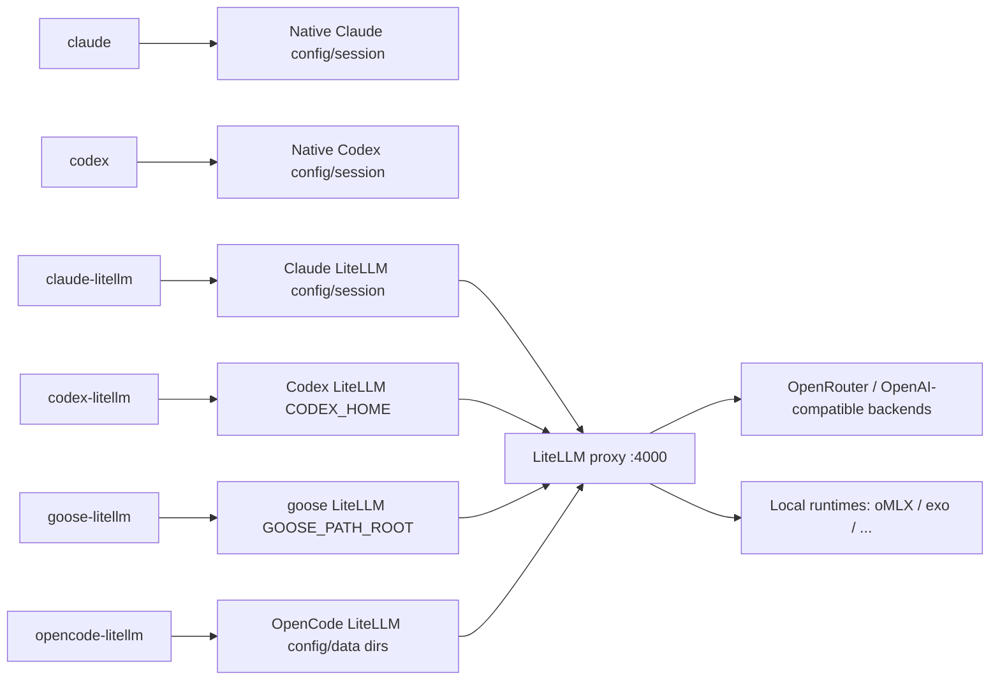

# Claude Code / Codex LiteLLM Architecture

Last updated: 2026-06-07

## 결론

현재 구조는 여섯 가지 실행 경로를 분리한다.

- `claude`: native Claude Code OAuth/session
- `codex`: native Codex OAuth/session
- `claude-litellm`: Claude Code through local LiteLLM
- `codex-litellm`: Codex through local LiteLLM
- `goose-litellm`: goose through local LiteLLM
- `opencode-litellm`: OpenCode through local LiteLLM

provider/model registry에 대해서는 두 가지 source of truth만 둔다.

- **모델 라우팅**: package config의 `litellm_config.yaml` `model_list` (surface model_name → underlying provider model).
- **모델별 토큰 한도(context window / max output)**: 같은 파일의 `x-limits:` YAML 앵커. underlying 모델당 앵커 1개, surface 엔트리는 `model_info: *alias`로 참조한다. 앵커 한 줄을 고치면 모든 harness 설정이 파생된다([토큰 한도 / Context Window 관리](#토큰-한도--context-window-관리) 참조).

Claude Code의 매 요청 출력 예약은 모델 능력치가 아니므로 `x-limits`에 넣지 않는다. Claude harness adapter 정책(`__FABRIC_HOME__/config/ai-litellm/harnesses/claude.json`의 `adapterConfig.outputReservation`)에서 별도로 관리하고, 런처가 `CLAUDE_CODE_MAX_OUTPUT_TOKENS`와 `CLAUDE_CODE_AUTO_COMPACT_WINDOW`를 여기서 파생한다.

context window는 단일 숫자가 아니라 `native product/session`, `provider/API`, `LiteLLM route`, `harness metadata`, `runtime capability`가 따로 존재한다. 이 값들은 자동으로 상속되지 않는다. 확인은 `ai-litellm context matrix|probe|doctor`로 한다([Context Budget 검증](#context-budget-검증) 참조).

명령어는 noun-verb 체계(`ai-litellm <group> <verb>`)를 정본으로 한다([명령어 체계](#명령어-체계) 참조). 이 문서는 모델 표를 반복하지 않고, 확인 명령과 운영 원칙만 기록한다.

## 구조



## Source Of Truth

| 역할 | 파일 |
| --- | --- |
| Installed package root | `__FABRIC_HOME__` (default `__HOME__/.local/share/ai-litellm-fabric`) |
| LiteLLM provider/model registry | `__FABRIC_HOME__/config/litellm_config.yaml` |
| 모델별 토큰 한도 단일 출처 (`x-limits:` 앵커) | `__FABRIC_HOME__/config/litellm_config.yaml` |
| Claude LiteLLM alias/default/display names | `__FABRIC_HOME__/config/claude-litellm/settings.json` |
| Codex LiteLLM shortcuts | `__FABRIC_HOME__/config/codex-litellm/settings.json` |
| Harness descriptor schema | `__FABRIC_HOME__/config/ai-litellm/harnesses/schema.json` |
| Claude harness descriptor | `__FABRIC_HOME__/config/ai-litellm/harnesses/claude.json` |
| Codex harness descriptor | `__FABRIC_HOME__/config/ai-litellm/harnesses/codex.json` |
| goose harness descriptor | `__FABRIC_HOME__/config/ai-litellm/harnesses/goose.json` |
| OpenCode harness descriptor | `__FABRIC_HOME__/config/ai-litellm/harnesses/opencode.json` |
| Claude Code 출력 예약 정책 | `__FABRIC_HOME__/config/ai-litellm/harnesses/claude.json`의 `adapterConfig.outputReservation` |
| Codex LiteLLM generated config | `__FABRIC_HOME__/state/codex-litellm/codex-home/config.toml` |
| Codex LiteLLM compatibility catalog | `__FABRIC_HOME__/state/codex-litellm/model-catalog.json` |
| OpenCode LiteLLM generated config | `__FABRIC_HOME__/state/opencode-litellm/opencode.json` |
| Shared LiteLLM proxy settings | `__FABRIC_HOME__/config/ai-litellm/settings.json` |
| Shared LiteLLM proxy library | `__FABRIC_HOME__/config/ai-litellm/lib.zsh` |
| Reasoning probe observation cache (evidence, not source of truth) | `__FABRIC_HOME__/state/ai-litellm/reasoning-observations.json` |
| Shared LiteLLM proxy command shim | `__HOME__/.local/bin/ai-litellm` → `__FABRIC_HOME__/bin/ai-litellm` |
| Claude LiteLLM command shim | `__HOME__/.local/bin/claude-litellm` → `__FABRIC_HOME__/bin/claude-litellm` |
| Codex LiteLLM command shim | `__HOME__/.local/bin/codex-litellm` → `__FABRIC_HOME__/bin/codex-litellm` |
| goose LiteLLM command shim | `__HOME__/.local/bin/goose-litellm` → `__FABRIC_HOME__/bin/goose-litellm` |
| OpenCode LiteLLM command shim | `__HOME__/.local/bin/opencode-litellm` → `__FABRIC_HOME__/bin/opencode-litellm` |
| Claude client helper | `__FABRIC_HOME__/config/claude-litellm/shell.zsh` |
| Codex client helper | `__FABRIC_HOME__/config/codex-litellm/shell.zsh` |
| Native Codex user config | `__HOME__/.codex/config.toml` |

GitHub clone/download만으로 전역 명령이 등록되지는 않는다. `scripts/install.zsh`를 한 번 실행하면 package directory를 만들고, `__HOME__/.local/bin`에 얇은 shim을 생성한다. 이후 어느 디렉토리에서나 `claude-litellm`, `codex-litellm` 등을 호출할 수 있다. shim은 native `claude`, `codex`, `goose`, `opencode`를 대체하지 않는다.

`__FABRIC_HOME__/state/codex-litellm/codex-home/config.toml`은 generated config다. Codex provider base URL은 직접 관리하지 않고, 실행 시점에 `ai-litellm` server settings에서 파생한다.

Native Codex에는 현재 context catalog override를 두지 않는다. `__HOME__/.codex/config.toml`에 `model_catalog_json` 또는 `model_context_window`를 넣어 API/LiteLLM 쪽 context 값을 강제로 투영하지 않는다. native Codex는 installed Codex bundle/product session budget을 따른다. 확인:

```zsh
codex debug models | jq '.models[] | select(.slug=="gpt-5.5") | {slug, context_window, max_context_window, effective_context_window_percent}'
rg -n '^[[:space:]]*(model_catalog_json|model_context_window)[[:space:]]*=' ~/.codex/config.toml
```

과거에 `__HOME__/.codex/model-catalog-local.json`, `model-catalog-codex-safe.json`, `model-catalog-api-long.json`, `api-long.config.toml`로 native context를 늘리는 실험을 했지만, 이는 기본 설치 동작과 혼동을 만들 수 있어 제거했다. 다시 실험해야 한다면 운영 설정이 아니라 임시 profile로만 두고, 문서/doctor에는 `experimental`로 표시한다.

`~/.zshrc`는 `~/.local/bin`을 PATH에 추가할 뿐이다. helper는 interactive shell에 자동 source하지 않고, package 안의 각 command wrapper가 실행 시점에만 불러온다. 설치기는 native harness command 존재 여부를 강제하지 않는다. 없는 harness는 그 wrapper를 실제 실행할 때만 실패해야 한다.

## 명령어 체계

`ai-litellm`은 noun-verb 체계를 정본으로 한다. 그룹(noun)이 시스템 개념이고, verb가 그 개념에 대한 동작이다.

```zsh
ai-litellm proxy   status|start|stop|restart|logs [lines]|doctor [opts]
ai-litellm harness list|info <name>|launch <name> [model] [args...]|reasoning [name]
ai-litellm runtime list|status [name]|doctor <name>
ai-litellm model   list|info [model]|limits [model]|reasoning [model]|probe <model...>|capabilities
ai-litellm route   list|info [model]|probe <model...>|check [model...]
ai-litellm context matrix [filter]|probe <surface|all>|doctor
ai-litellm audit model-policy
ai-litellm key     status
ai-litellm sync [--dry-run] [--no-restart]  # 단일 출처에서 파생 설정 재생성 + 기본적으로 proxy 재기동
ai-litellm capabilities  # proxy/runtime capability 요약
```

기존 flat 명령(`ai-litellm start`, `route-info`, `harnesses`, `launch`, `claude-litellm --start` 등)은 그대로 동작하되 deprecated이며, stderr에 정본 형태를 안내한다. proxy lifecycle은 harness wrapper가 아니라 `ai-litellm proxy *`가 소유한다. `claude-litellm`/`codex-litellm`의 `--start|--stop|--restart|--logs|--doctor`는 deprecated이고, `--list`/`--status`(harness별 정보)와 `codex-litellm --route-info|--refresh-catalog`(codex 전용)만 wrapper에 남긴다.

## 확인 명령

실제 provider route는 모델에게 묻지 말고 LiteLLM metadata로 확인한다.

```zsh
ai-litellm model list
ai-litellm model info gpt-5.5
ai-litellm model limits          # 모델별 context/output 한도 표 (단일 출처)
ai-litellm reasoning matrix      # provider/backend reasoning capability 표
ai-litellm reasoning probe gpt-5.5 xhigh
ai-litellm reasoning doctor
ai-litellm model reasoning set gpt-5.4 none
ai-litellm model reasoning unset gpt-5.4
ai-litellm harness reasoning     # harness adapter reasoning resolver preview
ai-litellm harness reasoning set codex high
ai-litellm harness reasoning unset codex
ai-litellm context matrix          # native + LiteLLM + runtime context budget 표
ai-litellm context probe codex-cli-oauth
ai-litellm context probe codex-litellm
ai-litellm context probe omlx-runtime
ai-litellm context doctor
ai-litellm audit model-policy
ai-litellm route info
ai-litellm model probe local-omlx-gemma4-12b
ai-litellm harness list
ai-litellm harness info claude
ai-litellm harness info codex
ai-litellm harness info goose
ai-litellm harness info opencode

claude-litellm --status   # harness별 정보
claude-litellm --list
codex-litellm --status
codex-litellm --list
```

## Proxy 관리

`claude-litellm`과 `codex-litellm`은 같은 LiteLLM proxy를 공유한다. proxy lifecycle은 `ai-litellm`이 소유한다.

```zsh
ai-litellm proxy status
ai-litellm proxy start
ai-litellm proxy stop
ai-litellm proxy restart
ai-litellm proxy logs
ai-litellm proxy doctor
```

`ai-litellm proxy doctor`는 running proxy가 현재 registry hash를 로드했는지 확인한다. registry를 바꾼 뒤 재기동을 잊으면 `running proxy loaded current config` 또는 `running proxy routes match config`가 실패한다. 토큰 한도를 바꾼 경우 `ai-litellm sync` 한 번이면 파생 설정 재생성과 재기동이 모두 처리된다. 재기동 없이 생성물만 갱신하려면 `ai-litellm sync --no-restart`, 변경 없이 동작 계획만 확인하려면 `ai-litellm sync --dry-run`을 쓴다. `sync`는 Codex catalog/config, Claude isolated settings, OpenCode config 같은 파생물을 각 harness CLI 설치 여부와 분리해서 다룬다. 없는 native CLI는 catalog refresh나 launch에서만 skip/fail하고, metadata/doctor/config 생성은 깨지지 않아야 한다.

proxy start에는 lock을 둬서 꺼진 상태에서 동시에 시작해도 중복 기동을 피한다. 단, `stop`/`restart`/`sync`는 공유 proxy를 내리므로 실행 중인 Claude/Codex LiteLLM 세션 모두에 영향을 준다.

Codex shortcut은 shell 편의 기능일 뿐이다. harness, skill, 문서에는 shortcut보다 Codex surface model name을 쓴다.

`review`는 Codex의 실제 subcommand와 충돌하므로 shortcut으로 쓰지 않는다. 필요하면 `codex-auto-review`처럼 실제 model name을 직접 지정한다.

```zsh
codex-litellm codex-auto-review
```

## Harness 관리

Claude/Codex LiteLLM wrapper는 descriptor-backed adapter로 실행된다. 기존 `claude-litellm`/`codex-litellm` 명령은 유지하되, path, command, isolation, Codex subcommands, generated Codex config는 harness descriptor에서 읽는다.
goose/OpenCode도 native 실행과 별도로 `goose-litellm`/`opencode-litellm` managed profile을 둔다. goose는 env-injector adapter로, OpenCode는 generated-config adapter로 실행한다.

```zsh
ai-litellm harness list
ai-litellm harness info claude
ai-litellm harness info codex

ai-litellm harness launch claude sonnet -p "Reply with exactly OK" --no-session-persistence --tools ""
ai-litellm harness launch codex exec --skip-git-repo-check --sandbox read-only "Reply with exactly OK"
ai-litellm harness launch goose gpt-5.4 run --no-session --no-profile -q --max-turns 1 -t "Reply with exactly OK"
ai-litellm harness launch opencode gpt-5.4 run --agent plan --format json "Reply with exactly OK"
```

OpenCode `run --format json`이 stdout에 일부 event만 출력하는 경우가 있다. 이때 응답 text는 isolated data dir의 SQLite DB에 저장된다.

```zsh
sqlite3 -json __FABRIC_HOME__/state/opencode-litellm/data/opencode/opencode.db \
  "select data from part where data like '%OK%' order by time_created desc limit 5;"
```

## 토큰 한도 / Context Window 관리

LiteLLM-backed 모델별 context window(`max_input_tokens`)와 max output(`max_output_tokens`)의 단일 출처는 `litellm_config.yaml`의 `x-limits:` 앵커다. **underlying provider 모델당 앵커 1개**를 두고, 모든 surface 엔트리가 `model_info: *alias`로 참조한다. 8개의 surface model_name이 4개의 underlying 모델로 수렴하므로, facade가 늘어도 한도는 underlying 앵커에만 붙는다.

중요한 구분:

- **출력 능력치(capability)**: 모델이 낼 수 있는 최대 출력. `x-limits.*.max_output_tokens`가 정본이고, OpenCode `limit.output`처럼 capability metadata가 필요한 generated artifact는 여기서 파생한다.
- **출력 예약(reservation)**: harness가 매 요청에서 provider에 예약시키는 출력 토큰. 공유 윈도우 provider가 `입력 + 예약 출력 <= context`로 회계하면 이 값은 작아야 한다.

Claude Code는 `CLAUDE_CODE_MAX_OUTPUT_TOKENS`를 매 요청 `max_tokens` 예약으로 사용하므로, 이 env에는 `max_output_tokens` 능력치를 넣지 않는다. Codex LiteLLM은 Responses 요청에 신뢰할 만한 output cap을 주입하지 못하므로 generated catalog의 `context_window`를 safe input budget으로 낮춘다. Goose도 `GOOSE_MAX_TOKENS`를 통해 매 응답 출력 예약을 낮춘다. OpenCode는 custom OpenAI-compatible provider에서 32k output ceiling을 쓸 수 있으므로 `OPENCODE_EXPERIMENTAL_OUTPUT_TOKEN_MAX`를 명시해 암묵적 fallback이 아니라 harness policy로 관리한다. 현재 reservation 기본 정책은 `32000`, tokenizer headroom `8192`, minimum input `32768`이다. 런처/생성기 계산식:

```text
output_reservation = adapterConfig.outputReservation(default/perTier/perModel)
effective_input = max_input_tokens - output_reservation - tokenizer_headroom
CLAUDE_CODE_MAX_OUTPUT_TOKENS = output_reservation
CLAUDE_CODE_AUTO_COMPACT_WINDOW = effective_input
CODEX model-catalog.context_window = effective_input
```

이 분리는 harness별 runtime 예약에만 적용한다. OpenCode/Goose가 capability metadata로 쓰는 `max_output_tokens` anchor는 바꾸지 않는다. Codex catalog는 capability source가 아니라 `codex-litellm` 전용 compatibility shim이므로 raw provider window 대신 safe input window를 기록한다. raw LiteLLM client와 future harness의 초과 출력 예약은 proxy-level C4 hook(`ai_litellm_callbacks.output_clamp.proxy_handler_instance`)이 deployment 직전에 `max_tokens`/`max_completion_tokens`를 model-aware safe cap으로 낮춘다. doctor는 이 hook과 `x-gateway-output-clamp` 정책이 빠지면 실패한다.

native Codex/Claude의 제품 세션 budget은 이 앵커를 상속하지 않는다. OpenAI API의 `gpt-5.5` context, Codex App/CLI OAuth context, Codex LiteLLM facade context는 서로 다른 claim으로 관리한다.

```yaml
x-limits:
  kimi_k26: &kimi_k26 { max_input_tokens: 262144, max_output_tokens: 262144 }
model_list:
  - model_name: Kimi-K2.6
    litellm_params: { model: openrouter/moonshotai/kimi-k2.6, api_key: os.environ/OPENROUTER_API_KEY }
    model_info: *kimi_k26
  - model_name: gpt-5.4        # 같은 underlying → 같은 앵커
    litellm_params: { model: openrouter/moonshotai/kimi-k2.6, api_key: os.environ/OPENROUTER_API_KEY }
    model_info: *kimi_k26
```

`x-limits:`는 LiteLLM이 모르는 최상위 키라 `safe_load`가 무시한다. `model_info`에는 public token/capability metadata만 두며 secret은 들어가지 않는다.

이 단일 출처에서 각 경로가 파생된다.

| 대상 | 파생 방식 | 자동? |
| --- | --- | --- |
| LiteLLM proxy (`/model/info` + pre-call enforcement) | `router_settings.enable_pre_call_checks: true` → 입력이 한도 초과 시 truncate가 아니라 `ContextWindowExceededError`로 거부 | proxy 재기동 시 |
| Codex `model-catalog.json`의 `context_window` | `codex-litellm --refresh-catalog` 생성기가 `adapterConfig.outputReservation`을 빼고 safe input window를 기록 | `ai-litellm sync` |
| OpenCode `opencode.json`의 `limit.{context,output}` | launch 시 렌더 | 다음 launch |
| Goose `GOOSE_CONTEXT_LIMIT` / `GOOSE_MAX_TOKENS` | launch env 주입(`adapterConfig.env`의 `{{reservation.effectiveInput}}` / `{{reservation.output}}`) | 다음 launch |
| Claude `CLAUDE_CODE_AUTO_COMPACT_WINDOW` / `_MAX_OUTPUT_TOKENS` | launch env 주입(활성 모델 기준; `_MAX_OUTPUT_TOKENS`는 capability가 아니라 reservation) | 다음 launch |
| OpenCode `OPENCODE_EXPERIMENTAL_OUTPUT_TOKEN_MAX` | launch env 주입(`adapterConfig.env`의 `{{reservation.output}}`) | 다음 launch |

Claude/Goose는 gateway에서 context window를 자동 discovery하지 못하므로(검증된 한계) launch 시 env로 주입한다. Claude의 `AUTO_COMPACT_WINDOW`은 tier가 믿는 window(200K, `[1m]`이면 1M) 아래로만 낮출 수 있다. 공유 윈도우 provider에서는 Claude의 compact threshold를 `effective_input`으로 낮춰 provider 거부 전에 압축이 걸리게 한다. 어느 경우든 LiteLLM pre-call enforcement가 진짜 한도를 강제하는 최종 backstop이다.

```zsh
ai-litellm model limits            # 모델별 context/output 표
ai-litellm model limits gpt-5.4    # 특정 모델
ai-litellm proxy doctor            # "harness configs match single-source limits"로 staleness 점검
```

한도 변경 절차: `x-limits` 앵커 한 줄을 고치고 `ai-litellm sync` 한 번. 새 모델 추가 시에도 한도 숫자는 앵커에 한 번만 적고 surface 엔트리는 `model_info: *alias`로 참조한다.

## Context Budget 검증

context budget은 다음 층위로 분리해서 본다.

| 층위 | 예 | 관리 원칙 |
| --- | --- | --- |
| native product/session | `codex`, `claude` | provider/API 또는 LiteLLM facade 값을 자동 상속하지 않는다. 공식 문서와 local startup metadata로만 판단한다. |
| provider/API declared | OpenAI API `gpt-5.5`, OpenRouter `/models` | provider가 선언한 모델 한도. routing endpoint별 실제 cap과 다를 수 있으므로 `source_confidence`를 둔다. |
| LiteLLM route enforced | `model_info.max_input_tokens`, `enable_pre_call_checks` | oversized prompt를 provider로 보내기 전에 거부하는 gateway backstop. |
| harness metadata/compaction | Codex catalog, Claude auto compact, Goose context env, OpenCode `limit` | 실제 provider enforcement인지, 표시/compaction/accounting인지 구분한다. |
| local runtime capability | oMLX `/v1/models`, model `config.json` | runtime capability와 LiteLLM policy cap이 다를 수 있다. |

read-only 확인 명령:

```zsh
ai-litellm context matrix
ai-litellm context matrix codex-litellm
ai-litellm context probe codex-cli-oauth
ai-litellm context probe codex-cli-api
ai-litellm context probe codex-litellm
ai-litellm context probe omlx-runtime
ai-litellm context doctor
```

## Proxy Output Clamp 검증

LiteLLM gateway의 입력 한도 방어와 출력 예약 clamp는 별개다. LiteLLM 문서상 `router_settings.enable_pre_call_checks`와 `model_info.max_input_tokens`는 provider 호출 전에 입력 token 초과를 거부하는 레버다. 반면 harness가 큰 `max_tokens` 또는 `max_completion_tokens`를 명시했을 때 provider 직전 요청을 안전하게 낮추는지는 별도 검증이 필요하다.

검증 harness:

```zsh
./scripts/verify_litellm_token_clamp.py
```

이 스크립트는 실제 provider를 호출하지 않는다. 로컬 OpenAI-compatible mock provider와 임시 LiteLLM proxy를 띄운 뒤, mock provider가 받은 JSON body를 증거로 삼는다.

LiteLLM 1.81.14 기준 관찰:

- `litellm_params.max_tokens`는 client가 `max_tokens`를 보내지 않으면 기본값으로 upstream에 들어간다.
- plain config는 client가 더 큰 `max_tokens`를 보내면 override하지 못한다.
- `litellm_settings.modify_params: true`는 client `max_tokens`를 route의 `litellm_params.max_tokens`까지 낮춘다.
- `modify_params: true`만으로는 client `max_completion_tokens`를 낮추지 못한다.
- custom callback의 `async_pre_call_deployment_hook`은 deployment 선택 뒤 provider 호출 직전에 `max_tokens`와 `max_completion_tokens`를 모두 낮추는 것이 확인됐다.

따라서 production 정책은 harness-side reservation을 1차 방어로 유지하고, proxy-level C4 hard clamp를 defense-in-depth로 켠다. hook 파일은 `config/ai_litellm_callbacks/output_clamp.py`이고 `litellm_settings.callbacks`에서 `ai_litellm_callbacks.output_clamp.proxy_handler_instance`를 참조한다. hook은 `async_pre_call_deployment_hook`에서 deployment 선택 뒤 `model_info.max_output_tokens`(capability)와 `x-gateway-output-clamp`의 `default/tokenizer_headroom/minimum_input` 정책을 결합해 safe cap을 계산한다. client가 그보다 큰 `max_tokens` 또는 `max_completion_tokens`를 보낸 경우에만 값을 낮추며, 요청에 출력 토큰 key가 없으면 새 예약값을 주입하지 않는다.

현재 기본값:

```yaml
x-gateway-output-clamp:
  enabled: true
  default: 32000
  tokenizer_headroom: 8192
  minimum_input: 32768
```

`ai-litellm context matrix`의 핵심 컬럼:

| 컬럼 | 의미 |
| --- | --- |
| `surface` | 실행 표면. 예: `codex-cli-oauth`, `codex-litellm`, `opencode-litellm`, `omlx-runtime`. |
| `selection` | 사용자가 고르는 모델/tier/default 이름. |
| `auth` | OAuth, API key, LiteLLM master key, local 등 auth lane. |
| `provider_model` | 실제 provider/backend model. native surface는 native provider model, LiteLLM surface는 `litellm_params.model`. |
| `budget_kind` | `provider-declared`, `harness-session`, `harness-catalog+router`, `display/compact+router`, `runtime-capability` 등. |
| `declared(ctx/out)` | 공식/provider/runtime이 선언한 값. |
| `configured(ctx/out)` | 현재 local config에 들어간 값. |
| `observed` | bounded probe나 session event에서 관측한 값. 과거 session event는 historical evidence로만 본다. |
| `effective_input` | 현재 architecture가 입력 예산으로 다루는 값. Reservation policy가 있는 harness는 출력 예약과 tokenizer headroom을 차감한 값이다. |
| `enforcement` | 실제 차단 계층. 예: Codex catalog, LiteLLM pre-call, runtime+LiteLLM. |
| `confidence` | official, local-config, unprobed, inactive, model-file 등 신뢰도 태그. |

LiteLLM-backed harness 행은 harness 이름별 `case`가 아니라 descriptor에서 파생한다. `adapterConfig.context.surface`, `budgetKind`, `authLane`, `confidence`가 row metadata이고, selection은 descriptor의 `models.default`, `models.small`, `models.mode=tier-aliases`, settings alias, `localCatalogEntries`, 또는 명시 `adapterConfig.context.selections`에서 온다. 새 harness가 descriptor에 모델 선택을 갖고 있으면 `ai-litellm context matrix`와 `ai-litellm context probe all`에 코드 수정 없이 나타난다. `context doctor`는 descriptor surface 중복을 실패로 잡는다.

`ai-litellm context doctor`는 context 전용 guardrail이다. 현재 검사/경고:

- native Codex에 active `model_catalog_json`/`model_context_window` override가 없는지 확인한다.
- native Codex active `gpt-5.5` metadata가 bundled catalog와 같은지 확인한다.
- LiteLLM `enable_pre_call_checks`가 켜져 있는지 확인한다.
- gateway output clamp 정책이 유효하고 C4 callback이 설정되어 있는지 확인한다.
- harness descriptor의 context surface가 중복되지 않는지 확인한다.
- Codex/OpenCode generated config가 `x-limits` 단일 출처와 drift하지 않는지 확인한다.
- output reservation 정책이 있는 모든 harness가 최소 입력 여유를 남기는지 확인한다.
- OpenCode가 output reservation env 없이 32000 기본 clamp에 걸릴 수 있으면 경고한다.
- Goose가 context만 주입하고 `GOOSE_MAX_TOKENS` output reservation을 빠뜨리면 경고한다.
- oMLX runtime/model file context가 LiteLLM policy cap보다 큰 경우를 경고한다.
- GLM-5.1 output cap처럼 provider public metadata로 확증되지 않은 local-configured 값을 낮은 confidence로 표시하도록 경고한다.

중요한 판정 규칙:

- native Codex surface는 LiteLLM facade 한도를 상속하지 않는다.
- API model spec은 OAuth/App spec이 아니다. 공식 문서나 local startup metadata가 없으면 `unknown` 또는 `inactive`로 둔다.
- OpenRouter `/models.context_length`는 model-level metadata이며, endpoint routing별 실제 cap 검증과 구분한다.
- runtime capability가 더 크더라도 LiteLLM `model_info.max_input_tokens`가 낮으면 현재 effective input budget은 policy cap 쪽이다.

## Reasoning / Effort 관리

reasoning, effort, thinking은 두 레이어로 분리한다.

- **Provider/backend default**: OpenRouter/LiteLLM/backend route가 wire parameter를 받을 수 있는지와, harness가 아무 값을 내지 않을 때 적용할 route 기본값. 예: OpenRouter `reasoning`, `include_reasoning`.
- **Harness intent**: Claude Code, Codex, goose, OpenCode가 선택 모델과 effort/thinking 개념을 어떻게 해석하고 전달하는지. 예: Claude tier(`opus`/`sonnet`/`haiku`) + `--effort`, Codex `model_reasoning_effort`, OpenCode `run --variant`.

이 둘은 독립적으로 관리한다. 실제 요청에서 둘 다 존재하면 `explicit harness intent > harness auto/default > provider/route default > no reasoning override` 순서로 해석한다. provider default는 LiteLLM route에 붙는 기본값이고, harness intent는 해당 harness가 자기 CLI/config/env 방식으로 표현하는 실행 의도다.

```zsh
ai-litellm reasoning matrix         # model_name -> provider/backend reasoning capability
ai-litellm reasoning matrix gpt-5.5
ai-litellm reasoning probe gpt-5.5 xhigh
ai-litellm reasoning doctor
ai-litellm model reasoning set gpt-5.4 none
ai-litellm model reasoning unset gpt-5.4
ai-litellm harness reasoning        # harness selection -> resolved model -> effective preview
ai-litellm harness reasoning claude
ai-litellm harness reasoning set claude xhigh
ai-litellm harness reasoning set codex high
ai-litellm harness reasoning set opencode high
ai-litellm harness reasoning unset opencode
```

`ai-litellm reasoning matrix`는 provider/backend 관점의 표다. 기존 `ai-litellm model reasoning [model]` table alias는 deprecated이며 stderr 경고 후 같은 표로 위임한다. `ai-litellm model reasoning` 그룹은 `set|unset|probe` mutation/probe surface로 유지한다. 이 표는 capability를 한 칸으로 뭉치지 않는다.

| 컬럼 | 의미 |
| --- | --- |
| `declared` | `litellm_config.yaml`의 `model_info.supports_reasoning` 선언값. 사람이 관리하는 local claim이다. |
| `litellm_cap` | 현재 설치된 LiteLLM runtime이 `supports_reasoning()`/`get_supported_openai_params()`로 보기에 reasoning 계열 parameter를 지원하는지. |
| `default` | route에 설정된 provider default. `ai-litellm model reasoning set`이 쓰는 값은 `reasoning_effort`다. |
| `local_wire` | 현재 LiteLLM adapter가 OpenAI-style parameter로 받아준다고 선언한 wire key. 비어 있으면 local LiteLLM은 해당 parameter를 지원한다고 보지 않는다. |
| `drop_risk` | `declared=yes`인데 `litellm_cap=no`인 경우, `drop_params:true` 때문에 요청 parameter가 조용히 떨어질 수 있는지. |
| `observed` | bounded probe 결과. `yes(N)`은 `reasoning_tokens` 또는 reasoning field가 관측됐다는 뜻이고, `no(0)`은 해당 probe에서는 관측되지 않았다는 뜻이다. 같은 backend를 공유하는 facade는 backend-level observation을 같이 보여준다. |

즉 `declared=yes`는 실제 wire 도달을 뜻하지 않는다. 현재 OpenRouter route는 provider 문서상 unified `reasoning`을 지원하더라도, local LiteLLM adapter가 `reasoning_effort`를 지원한다고 보지 않으면 `drop_risk=high(drop)`으로 표시한다.

`ai-litellm reasoning probe <model> [effort]`는 proxy가 이미 떠 있을 때만 작은 chat-completions 요청을 보내고, 응답의 `usage.completion_tokens_details.reasoning_tokens`, `message.reasoning`, `reasoning_content`, `reasoning_details`를 관측한다. proxy를 자동 시작하지 않으며, 결과는 secret 없는 `__FABRIC_HOME__/state/ai-litellm/reasoning-observations.json`에 최신 model별 observation으로 저장되어 `observed` 컬럼에 반영된다. 이 파일은 evidence cache이지 source of truth가 아니다. `no(0)`은 “이 probe에서는 reasoning을 보지 못했다”는 뜻이지, provider가 reasoning을 절대 지원하지 않는다는 증명은 아니다.

`set`/`unset`은 **underlying 모델 단위로** 동작한다. 토큰 한도 anchor와 같은 single-source 불변식을 지키기 위해, 한 surface model_name에 `set`하면 같은 backend를 가리키는 모든 facade에 동일하게 적용된다(예: `gpt-5.4` 설정 시 `Kimi-K2.6`·`gpt-5.4`·`gpt-5.4-mini` 모두). wire field는 LiteLLM의 계약된 키인 `reasoning_effort`를 쓴다(raw top-level `reasoning:` 키는 비계약 passthrough라 쓰지 않는다 — LiteLLM이 OpenRouter는 `reasoning:{effort}`, OpenAI는 `reasoning_effort`로 매핑한다). 허용값: OpenRouter `none|minimal|low|medium|high|xhigh`, OpenAI `minimal|low|medium|high`.

주의: `openrouter/deepseek/*` route는 LiteLLM upstream 버그(#27439)로 effort 단계가 on/off로 평탄화될 수 있다. 단계 구분이 중요한 모델은 `extra_body.reasoning.effort` 사용을 고려한다.

`ai-litellm harness reasoning`은 harness adapter 관점의 resolver preview다. 핵심 컬럼:

| 컬럼 | 의미 |
| --- | --- |
| `adapter` | descriptor의 harness adapter. 새 harness는 이 adapter 의미를 공통 schema로 번역한다. |
| `selection` | harness 사용자가 고르는 이름. Claude는 `opus` 같은 tier, Codex는 `gpt-5.4` 같은 surface model. |
| `resolved_model` | LiteLLM `model_name`으로 해석된 값. |
| `prov_reas` | 해당 backend가 provider reasoning control을 지원하는지. |
| `control` | harness가 reasoning intent를 갖는지(`intent`) 또는 provider default에 맡기는지(`none`). |
| `effort` | harness가 현재 표현하는 effort 값. `auto`는 harness 내부 기본값/세션 상태에 맡긴다는 뜻이다. |
| `source` | adapter가 effort/thinking 의미를 읽는 위치. |
| `effective` | 현재 설정의 해석 결과. 예: `harness-intent`, `harness-auto`, `provider-default`, `intent-unsupported`. |
| `confidence` | configured/inferred/unknown. 실제 token 변화 검증 전에는 `verified`로 올리지 않는다. |

`ai-litellm harness reasoning set/unset`은 descriptor를 수정한다. Claude는 명시 effort를 `--effort`로 주입하고 사용자가 직접 넘긴 `--effort`가 있으면 건드리지 않는다. Claude `auto`는 CLI flag를 주입하지 않으므로 표에서는 `harness-auto`로 표시된다. Codex는 descriptor의 `modelReasoningEffort`를 바꾸고 `ai-litellm sync` 때 `config.toml`의 `model_reasoning_effort`로 내려간다. OpenCode는 현재 설치된 CLI 기준으로 `opencode run --variant`에만 자동 주입한다. Goose는 현재 명시 reasoning control을 노출하지 않으므로 `auto|none` 외의 harness effort는 거부한다.

## Local Runtime 관리

local runtime은 `ai-litellm`이 자동으로 켜지 않는다. 사용자가 직접 runtime을 켜고 끄며, wrapper는 선택한 모델이 요구하는 runtime이 준비되어 있는지만 확인한다.

```zsh
omlx start
omlx stop

ai-litellm runtime list
ai-litellm runtime status
ai-litellm runtime status omlx
ai-litellm runtime doctor omlx
ai-litellm capabilities
```

runtime은 settings.json의 `runtimes.<name>` 블록으로 기술한다. `kind`가 readiness adapter를 결정하며(현재 `openai-compatible` — oMLX/exo/vLLM/Ollama(`/v1`) 공통, 미지원 kind는 loud-fail), `startCommandBinary`(없으면 `startCommand` 첫 단어)로 바이너리 존재를 점검한다. `ai-litellm proxy doctor`와 `ai-litellm runtime doctor`는 runtime 블록 유효성, registry 정합성(expectedModels ⊆ registry, prefix-매칭 모델의 `api_base` == runtime `apiBase`, 모든 `local-*` 모델이 어떤 runtime prefix에 속하는지), endpoint/port 충돌(다른 runtime·proxy와 겹치지 않는지)을 검사한다.

runtime별 concrete model name은 충돌을 피하기 위해 prefix를 둔다.

```zsh
local-omlx-gemma4-12b
```

`exo` 등 다른 runtime을 추가할 때도 같은 방식으로 `local-exo-*`처럼 별도 prefix를 쓴다. 같은 concrete local `model_name`을 여러 runtime에 중복 등록하지 않는다.

oMLX 모델 테스트:

```zsh
curl http://127.0.0.1:8000/v1/models
ai-litellm model info local-omlx-gemma4-12b
claude-litellm local-omlx-gemma4-12b -p "Reply with exactly LOCAL_OK" --no-session-persistence --tools ""
codex-litellm local-omlx-gemma4-12b exec --skip-git-repo-check --sandbox read-only "Reply with exactly LOCAL_OK"
goose-litellm local-omlx-gemma4-12b run --no-session --no-profile -q --max-turns 1 -t "Reply with exactly LOCAL_OK"
opencode-litellm local-omlx-gemma4-12b run --agent plan --format json "Reply with exactly LOCAL_OK"
```

## Secret 관리

설정 파일에는 API key를 평문으로 두지 않는다.

현재 Keychain 기준:

- OpenRouter API key: service `openrouter-api-key`
- LiteLLM master key: service `litellm-master-key`
- Brave Search API key: service `brave-search-api-key`

상태 확인:

```zsh
ai-litellm key status
security find-generic-password -s brave-search-api-key -a "$USER" >/dev/null && echo "Brave Search key: Keychain ok"
```

금지:

- `~/.zshrc`에 API key export
- `litellm_config.yaml`에 평문 `api_key` 또는 평문 `master_key`
- Claude/Codex settings 파일에 provider API key 저장
- Codex `shell_environment_policy.set`에 API key 저장

`ai-litellm` shared library는 Keychain 또는 private env file에서 secret을 읽되, 현재 셸에 export하지 않는다. 필요한 subprocess에만 환경변수로 주입한다.

### Multi-provider secret 주입

`litellm_config.yaml`이 참조하는 **모든** `os.environ/<VAR>`(OpenRouter뿐 아니라 OpenAI/Anthropic/Gemini 등 직결 provider 포함)는 proxy 기동 시 자동으로 resolve되어 proxy subprocess에만 주입된다. 셸 export는 필요 없다(오히려 `ai-litellm proxy doctor`가 export를 안티패턴으로 경고).

- 기본 Keychain service 이름은 변수명을 소문자-하이픈으로 변환한 형태다. 예: `OPENAI_API_KEY` → service `openai-api-key`, `ANTHROPIC_API_KEY` → `anthropic-api-key`, account `$USER`.
- 다른 service/account를 쓰려면 `settings.json`의 `secrets.<VAR>.{keychainService,keychainAccount}`로 override한다.
- registry가 참조하는 key가 Keychain/env-file에 없으면 기동 시 `warn`을 내고, `proxy doctor`가 `provider key available: <VAR>`로 FAIL 처리한다.
- harness descriptor가 proxy를 거치지 않고 provider에 직접 인증해야 하면 `provider.auth.source`에 `env:<VAR>` 또는 `keychain:<service>`를 쓸 수 있다.

따라서 직결(non-OpenRouter) provider도 `model_list` 라우트 1블록 + 해당 key를 Keychain에 저장하는 것만으로 배선된다. `litellm_config.yaml`에는 여전히 `os.environ/...`만 두고 평문 key는 두지 않는다.

## 모델 추가 절차

1. `__FABRIC_HOME__/config/litellm_config.yaml`에 provider-facing model을 추가한다. underlying 모델의 토큰 한도가 새로우면 `x-limits:`에 앵커 1개를 추가하고, 새 `model_list` 엔트리는 `model_info: *alias`로 그 앵커를 참조한다.
2. Claude에서 쓸 모델이면 `__FABRIC_HOME__/config/claude-litellm/settings.json`의 alias를 바꾼다.
3. Codex에서 쓸 모델이면 `__FABRIC_HOME__/config/litellm_config.yaml`의 Codex surface model entry가 새 backend를 바라보게 하고, Codex 슬러그로 노출하려면 `__FABRIC_HOME__/config/ai-litellm/harnesses/codex.json`의 `localCatalogEntries`에 추가한다.
4. `ai-litellm sync`로 파생 설정(Codex 카탈로그, Codex config, OpenCode config)을 재생성하고 proxy를 재기동한다.
5. 확인 명령으로 실제 route, 한도, context budget 층위를 검증한다.

```zsh
ai-litellm sync

ai-litellm model list
ai-litellm model limits
ai-litellm context matrix
ai-litellm context doctor
ai-litellm route info
ai-litellm proxy doctor
```

## Codex Model Catalog

`__FABRIC_HOME__/state/codex-litellm/model-catalog.json`은 `codex-litellm` 전용 compatibility shim이다. native `~/.codex` catalog가 아니다. Codex surface model name은 유지하되, OpenRouter/local backend가 거부할 수 있는 Codex 전용 tool capability를 낮춰 둔다. OpenRouter-backed 슬러그의 `context_window`/`max_context_window`는 `litellm_config.yaml`의 `model_info`(단일 출처)와 Codex harness `adapterConfig.outputReservation`에서 파생되는 safe input window다. 예를 들어 Kimi 기반 `gpt-5.4`는 raw provider window `262144`가 아니라 `262144 - 32000 - 8192 = 221952`로 생성된다. Local runtime 슬러그는 이미 LiteLLM policy cap이 runtime observed cap보다 낮으므로 catalog에서 추가로 줄이지 않는다. `auto_compact_token_limit`은 null로 재설정되어 교정된 window에서 compaction이 다시 계산된다.

이 파일은 route의 source of truth가 아니다. Codex CLI 업데이트 뒤, 또는 토큰 한도 변경 뒤 재생성한다.

```zsh
codex --version
ai-litellm sync                  # catalog + config + proxy까지 한 번에 반영
codex-litellm --list
```

local Codex catalog entry는 `__FABRIC_HOME__/config/ai-litellm/harnesses/codex.json`의 `models.localCatalogEntries`에서 파생된다. refresh logic은 descriptor를 읽어 generated catalog에 local entry를 다시 붙인다.

## 운영 체크리스트

모델 또는 토큰 한도를 바꾼 날:

```zsh
ai-litellm sync
ai-litellm model list
ai-litellm model limits
ai-litellm reasoning matrix
ai-litellm harness reasoning
ai-litellm context matrix
ai-litellm context doctor
ai-litellm route info
ai-litellm proxy doctor
ai-litellm capabilities
```

키 관리 점검:

```zsh
ai-litellm key status
```

평문 키 흔적 점검:

```zsh
./scripts/check.zsh
```

정상이라면 helper 코드, 주석 템플릿, vendor 예제 외에 실제 key 값이 나오면 안 된다.

## 2026-06-07 감사 권고 결정 로그

- Claude output reservation: 구현. `max_output_tokens` 능력치 anchor는 그대로 두고, Claude harness에 `adapterConfig.outputReservation`을 추가했다. 채택 범위는 (1) 출력 예약 분리와 (3) 회계 정직화이다. proxy-level C4 hook은 별도 gateway defense-in-depth로 활성화했다.
- Goose/OpenCode reservation: 구현. Goose는 `GOOSE_CONTEXT_LIMIT={{reservation.effectiveInput}}`와 `GOOSE_MAX_TOKENS={{reservation.output}}`를 주입한다. OpenCode는 `OPENCODE_EXPERIMENTAL_OUTPUT_TOKEN_MAX={{reservation.output}}`를 주입한다. context doctor는 Claude 전용 체크 대신 모든 `adapterConfig.outputReservation` harness를 검사한다.
- Proxy output clamp 검증/활성화: 구현. `scripts/verify_litellm_token_clamp.py`가 mock provider로 LiteLLM 1.81.14를 검증한다. plain config는 client `max_tokens` override를 막지 못하고, `modify_params:true`는 `max_tokens`만 낮춘다. `max_completion_tokens`까지 포함한 hard clamp는 `async_pre_call_deployment_hook`에서 검증됐고, production hook은 `config/ai_litellm_callbacks/output_clamp.py`로 활성화했다.
- M1: 구현. context matrix/probe를 descriptor-driven으로 바꾸고 `adapterConfig.context`를 추가했다. 새 descriptor harness는 모델 선택이 registry에 있으면 코드 수정 없이 context row가 생긴다.
- M5: 부분 구현. context capability는 descriptor data block으로 옮겼고, provider reasoning set/unset은 단일 mutation 함수와 단일 atomic write로 합쳤다. harness reasoning mutation은 adapter별 allowed/default/build 규칙을 한 Node table로 모았다. 더 큰 registry-normalization core 추출은 Ruby/Python/Node 경계를 동시에 흔드는 리팩터라 이번에는 보류한다.
- M6: 구현. `reasoning matrix`가 read/observability 정본이고, `model reasoning [model]` table alias는 deprecated 경고 후 위임한다. `model reasoning set|unset|probe`는 mutation/probe surface로 남긴다.
- LOW: 구현. route info는 `/model/info` curl 실패를 먼저 잡아 rc=1을 반환한다. reasoning observation lookup은 현재 backend와 다른 stale record를 skip한다. native Codex `gpt-5.5`/declared budget literal은 context matrix 내부 상수로 이름 붙였다.
- leanness: 구현/보류 혼합. 내부 dead function `ai_litellm_runtime_kind_supported`는 삭제했다. `_claude_litellm_source_env`는 로컬 호출자는 없지만 공개 호환 shim 묶음이라 삭제 보류. cross-language `provider_default` 통합과 matrix/doctor registry 재파싱 제거는 가치가 있으나 현 변경보다 blast radius가 커서 보류.
- 미구현 LOW: `codex-litellm/model-catalog.json`과 backend observed context cap 비교 warning은 보류한다. 현재 시스템에는 context cap observation cache가 없고, registry/codex catalog drift는 이미 `harness configs match single-source limits`에서 fail 처리한다.

## 2026-06-08 모델/하니스 context 감사 결정 로그

- C2/C5 Codex output protection: 구현. Codex CLI는 Responses body에 신뢰할 만한 output cap을 주입하지 못하므로, `codex` descriptor에도 `adapterConfig.outputReservation`을 추가하고 generated `model-catalog.json`의 `context_window`/`max_context_window`를 raw provider window가 아니라 safe input window로 낮춘다. Kimi 기반 `gpt-5.4`/`gpt-5.4-mini`는 `221952`로 생성되어 provider의 implicit output reservation 때문에 240K대 입력이 400으로 거부되는 경로를 줄인다. Local gemma는 C3의 낭비 이슈를 악화시키지 않도록 기존 `8192` policy cap을 유지한다.
- C4 gateway hard clamp: 구현. `async_pre_call_deployment_hook` 기반 production callback을 켰고, model_info capability와 `x-gateway-output-clamp` reservation policy에서 safe cap을 계산한다. raw client/future harness가 큰 `max_tokens` 또는 `max_completion_tokens`를 보내도 provider 직전에서 낮춘다.
- C1 Claude opus 1M, C3 gemma cap 상향, C6 GLM anchor 교정, C7 Codex `apply_patch` tool type: 보류. 각각 live probe 또는 provider cap 재확인이 필요하므로 blind edit하지 않는다.

## 장기 관리 원칙

모델 실험은 LiteLLM registry에서 자유롭게 한다. Claude/Codex가 바라보는 facade와 shortcut은 작고 안정적으로 유지한다.

문서에는 모델 매핑 표를 반복하지 않는다. 매핑을 바꾼 뒤에는 설정 파일과 확인 명령의 출력만 신뢰한다.
